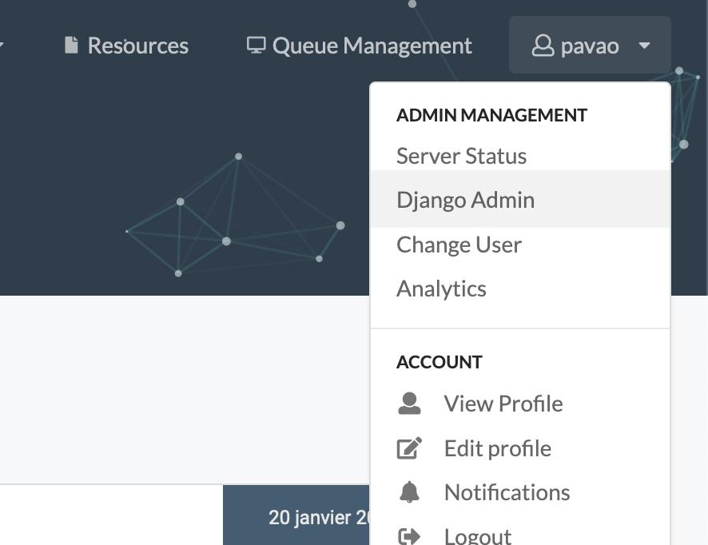
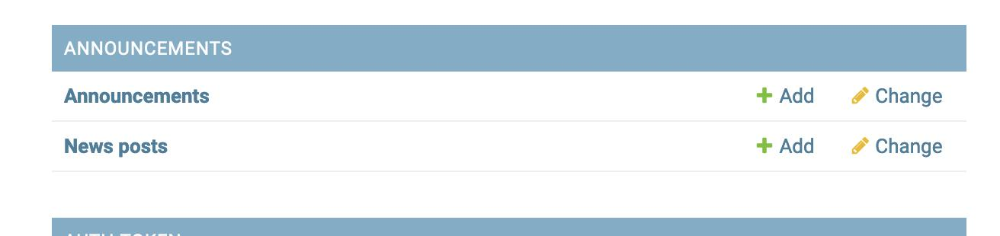
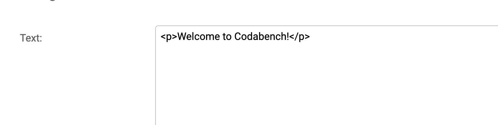
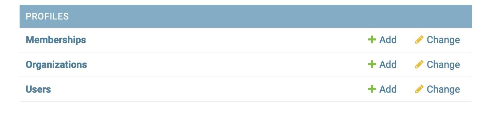
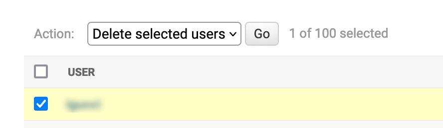
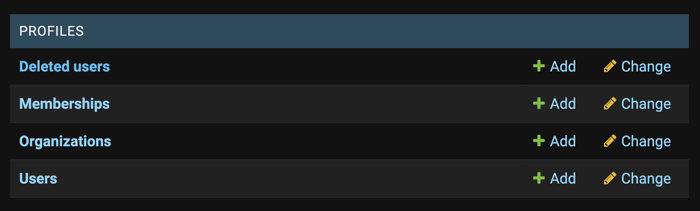
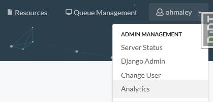
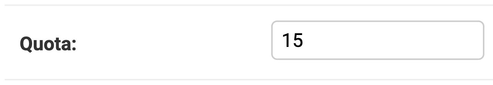

## Maintenance Mode
You can turn on maintenance mode by creating a `maintenance.on` file in the `maintenance_mode` folder. This will change the front page of the website, showing a customizable page (the `maintenance.html` file in the same folder).

Simply remove the `maintenance_mode/maintenance.on` file to end maintenance mode.

---
During testing, if you want to update or restart some services (e.g : Django), you should follow the following steps:

```bash
docker compose stop django
docker compose rm django ## remove old django container
docker compose create django ## create new django container with the changes from your development
docker compose start django
```

This procedure helps you update changes of your development on Django without having to restart every Codabench container.

## Give superuser privileges to a user

With superuser privileges, the user can edit any benchmark and can access the Django admin interface.

```python
docker compose exec django ./manage.py shell_plus
u = User.objects.get(username='<USERNAME>') ## can also use email
u.is_staff = True
u.is_superuser = True
u.save()
```

## Migration

```bash
docker compose exec django ./manage.py makemigrations
docker compose exec django ./manage.py migrate
```

## Collect static files

```bash
docker compose exec django ./manage.py collectstatic --noinput
```

## Delete POSTGRESDB and MINIO :
!!! warning
    This will delete all your data !

```bash
## Begin in codabench root directory
cd codabench
```

#### Purge data

```bash
sudo rm -r var/postgres/*
sudo rm -r var/minio/*
```


#### See data we are going to purge
```bash
ls var
```


#### Restart services and recreate database tables

```bash
docker compose down
docker compose up -d
docker compose exec django ./manage.py migrate
```

## Feature competitions in home page

There are two ways of setting a competition as featured:
1. Use Django admin (see below) -> click the competition -> scroll down to is featured filed -> Check/Uncheck it
2. Use competition ID in the django bash to feature or unfeature a competition
```python
docker compose exec django ./manage.py shell_plus
comp = Competition.objects.get(id=<ID>)  ## replace <ID> with competition id
comp.is_featured = True  ## set to False if you want to unfeature a competition
comp.save()
```

## Shell Based Admin Features
If you're running your own Codabench instance, there are different ways to interact with the application. Inside the `django` container (`#!bash docker compose exec django bash`) you can use `#!bash python manage.py help` to display all available commands and a brief description. By far the most useful are `createsuperuser` and `shell/shell_plus`. 


## Django Admin interface

Once you log in an account with superuser privileges, you have access to the "Django Admin" interface:



From this interface, you can change a user's quota, change their staff and superuser status, change the featured competitions displayed on the homepage, manage user accounts and more.

#### Edit announcement and news

In the Django admin interface, click on `Announcements` or `New posts`:



For announcement, only the first announcement is read by the front page. For news, all objects are read as separate news.
You can create and edit objects using the interface. Write the announcement and news using HTML to format the text, add links, and more:




#### Delete a user

Go to `Users`:



Select it, select the `Delete selected users` action and click on `Go`:
 



#### Ban/Unban a user

Go to `Users` in the `django admin`:



Search for user using the search bar, or use the filter on the right side. Click on the username of the user to open user details, scroll down to find `Is Banned`. Check/uncheck this option to toggle the banned status.


## RabbitMQ Management
The RabbitMQ management tool allows you to see the status of various queues, virtual hosts, and jobs. By default, you can access it at: `http://<your_codalab_instance>:15672/`. The username/password is your RabbitMQ `.env` settings for username and password. The port is hard-set in `docker-compose.yml` to 15672, but you can always change this if needed. For more information, see:
https://www.rabbitmq.com/management.html

## Flower Management
Flower is a web based tool for monitoring and administrating Celery clusters. By default, you can access the Flower web portal at `http://<your_codalab_instance>:5555/`. The username/password is your Flower `.env` settings for username and password. 5555 is the default port, and cannot be changed without editing the `docker-compose.yml` file.

For more information on flower, please visit:
[https://flower.readthedocs.io/en/latest/](https://flower.readthedocs.io/en/latest/)

## Storage analytics
#### The interface
The storage analytics page is accessible at [codabench-url/analytics/](https://www.codabench.org/analytics/) under the storage tab.



From this interface, you will have access to various analytics data:

- A Storage usage history chart
- A Competitions focused storage evolution, distribution and table
- A Users focused storage evolution, distribution and table

All of those data can be filtered by date range and resolution, and exported as CSVs.

The data displayed in those charts are only calculated from a background analytics task that takes place every Sunday at 02:00 UTC time (value editable in the `src/settings/base.py`).

#### The background task

The analytics task is a celery tasked named `analytics.tasks.create_storage_analytics_snapshot`.
What it does:

- It scans the database looking for file sizes that are not set or flagged in error
- Actually measures their size and saves it in the database
- Aggregate the storage space used by day and by Competition/User (for example every day for the last year for each competition) by looking at the database file size fields
- For data related to the _Platform Administration_ it measures as well the database backup folder directly from the storage instance.
- Everything is saved as multiple snapshot in time in each Category table (i.g.: `UserStorageDataPoint`)
- This tasks also runs a database <-> storage inconsistency check and saves the results in a log file located in the `var/logs/` folder

To manually start the task, you can do the following:

- Start codabench `docker compose up -d`
- Bash into the django container and start a python console:
```sh
docker compose exec django ./manage.py shell_plus
```
- Manually start the task:
```python
from analytics.tasks import create_storage_analytics_snapshot
eager_results = create_storage_analytics_snapshot.apply_async()
```
- If you check the logs (`docker compose logs -f`) of the app you should see "Task create_storage_analytics_snapshot started" coming from the site_worker container
- If you have to restart the task, don't worry, it will only compute the size of the files that hasn't been computed yet.
- Once the task is over you should be able to see the results on the web page


## Homepage counters

There is also a daily background task counting users, competitions and submissions, in order to display it on the homepage.

You can manually run it:

```bash
docker compose exec django ./manage.py shell_plus
```

```python
from analytics.tasks import update_home_page_counters
eager_results = update_home_page_counters.apply_async()
```


## User Quota management

#### Increase user quota

###### Using the Django Shell

```python
docker-compose exec django ./manage.py shell_plus
```

```python
u = User.objects.get(username='<USERNAME>') ## can also use email
u.quota = u.quota * 3 # We multiply the quota by 3 in this example
u.save()
```

###### Using the Django Admin Interface
- Go to the Django admin page
- Click user table
- Select the user for whom you want to increase/decrease quota
- Update the quota field with new quota (in GB e.g. 15)


## Codabench Statistics
You can create two types of codabench statistics: 

- Overall platform statistics for a specified year
- Overall published competitions statistics

Follow the steps below to create the statistics

#### Start codabench 
```bash
docker compose up -d
```
#### Bash into the django container and start a python console:
```bash
docker compose exec django ./manage.py shell_plus
```

#### For overall platform statistics
```python
from competitions.statistics import create_codabench_statistics
create_codabench_statistics(year=2024)
```
!!! note 
    - If `year` is not specified, the current year is used by default
    - A CSV file named `codabench_statistics_2024.csv` is generated in `statistics` folder (for year=2024)

#### For overall published competitions statistics
```python
from competitions.statistics import create_codabench_statistics_published_comps
create_codabench_statistics_published_comps()
```
!!! note 
    A csv file named `codabench_statistics_published_comps.csv` is generated in `statistics folder`

