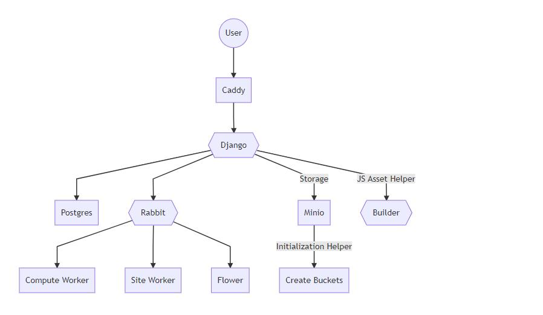
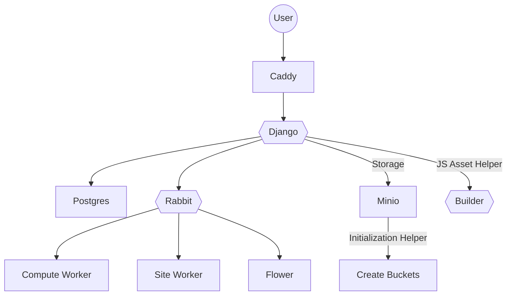
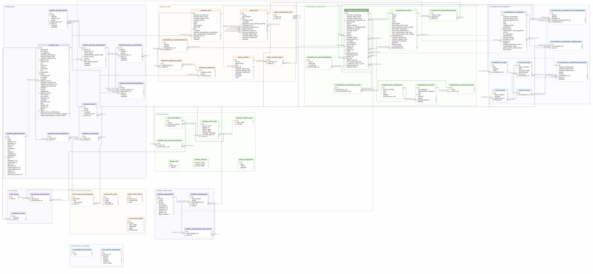

[Source](https://mermaidjs.github.io/mermaid-live-editor/#/edit/eyJjb2RlIjoiZ3JhcGggVERcbkEoKFVzZXIpKVxuQltDYWRkeV1cbkN7e0RqYW5nb319XG5EW1Bvc3RncmVzXVxuRnt7UmFiYml0fX1cbkdbTWluaW9dXG5IW0NyZWF0ZSBCdWNrZXRzXVxuSXt7QnVpbGRlcn19XG5LW0Zsb3dlcl1cbkxbQ29tcHV0ZSBXb3JrZXJdXG5NW1NpdGUgV29ya2VyXVxuQSAtLT4gQlxuQiAtLT4gQ1xuQyAtLT4gRFxuQyAtLT4gRlxuRiAtLT4gTFxuRiAtLT4gTVxuQyAtLT58U3RvcmFnZXxHXG5HIC0tPnxJbml0aWFsaXphdGlvbiBIZWxwZXJ8IEhcbkYgLS0-IEtcbkMgLS0-fEpTIEFzc2V0IEhlbHBlcnwgSVxuIiwibWVybWFpZCI6eyJ0aGVtZSI6ImRlZmF1bHQifX0):

Codabench consists of many docker containers that are connected and organized through docker compose. Below is an overview of each container and their function:

## Django
The main container that runs and contains the python code (A Django project). This is the container that is mainly used for utility functions like creating admins, creating backups, and manually making changes through the python django shell. It has a gunicorn webserver that serves internally on port 8000.

## Caddy
The HTTP/HTTPs web server. It acts as a reverse proxy for the Django container. This container controls SSL/HTTPs functionality and other web server configuration options. Serves on port 80/443.

## Postgres (Labeled DB in docker-compose)
The default database container. It will contain the default Postgres database used by codabench. (Name/user/pass,etc determined by .env.) If you need to make manual DB changes, this is the container to look into.

Here is the DB schema 

## Compute Worker
The container(s) (can be external) that runs submissions for the codabench instance on their associated queues. The default workers are tied to the default queue.
Commands to re-build the compute worker Docker image can be found [here](../Organizers/Running_a_benchmark/Compute-Worker-Management---Setup.md#building-compute-worker).

## Site Worker
The container that runs various tasks for the Django container such as unpacking and processing a competition bundle.

## Minio
The default storage solution container. Runs a MinIO instance that serves on the port defined by settings in your .env.

## Create Buckets
A helper container for the Minio container that initially creates the buckets defined by settings in your .env if they don't already exist. Usually this container exits after that.

## Builder
A container to build RiotJS tags into a single unified tag that can then be mounted. Uses NPM.

## Rabbit
Task/Message management container. Organizes queues for Celery Tasks and compute workers. Any queues that get created are accessible through rabbit's own command line interface.

## Flower
Administrative utility container for Celery tasks and queues.

## Competition docker image

The services of Codabench run inside Docker environments. This should not be confused with the Docker environment used to run the submissions, which may vary for each benchmark. The docker running submissions is discussed [here](Submission-Docker-Container-Layout.md)