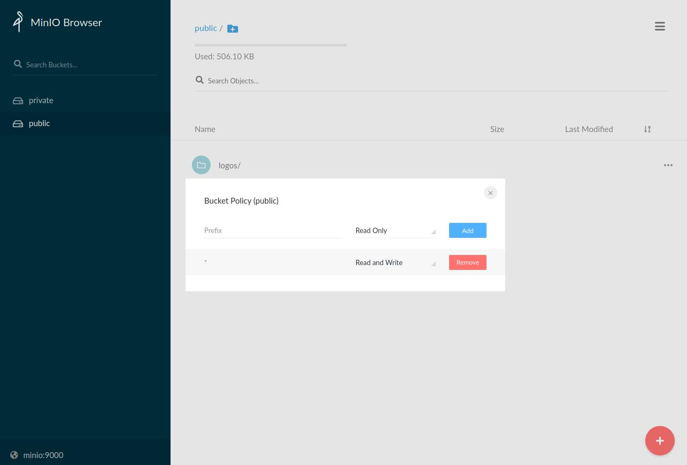
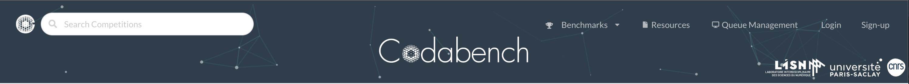
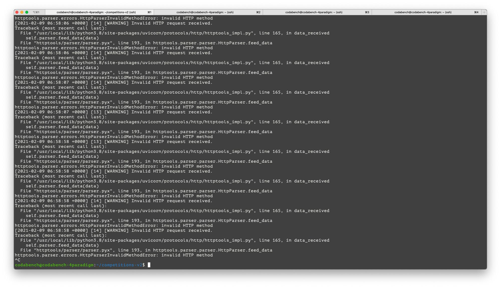
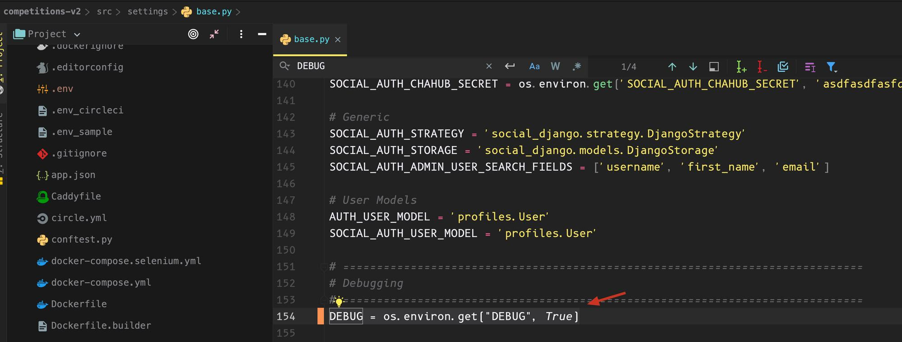
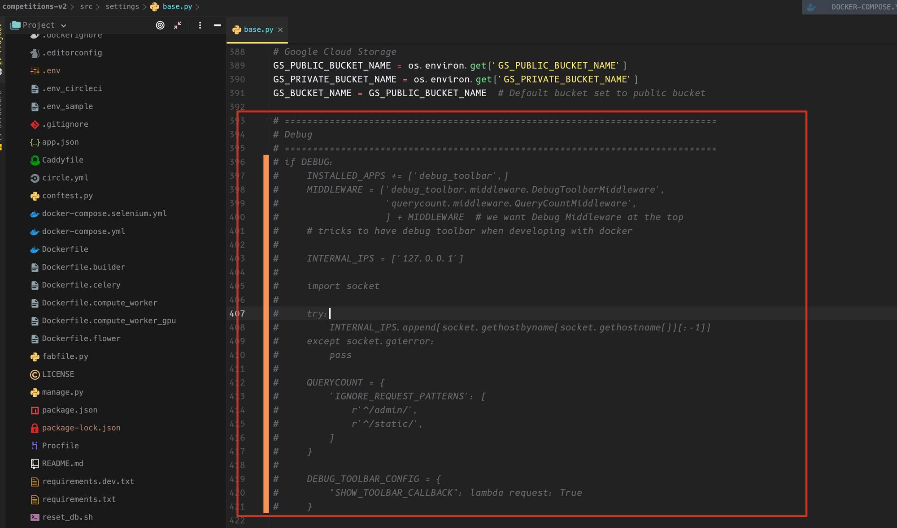
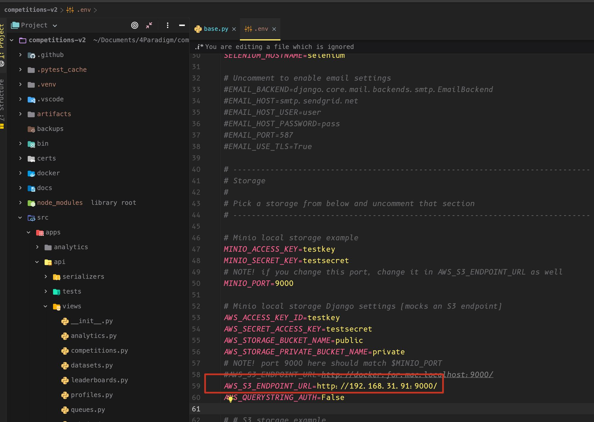
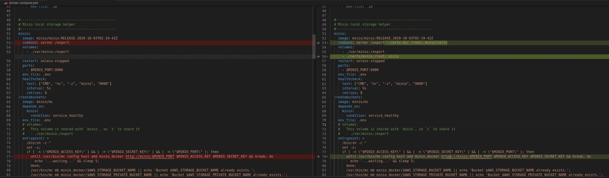

## Overview
This document focuses on how to deploy the current project to the local machine or server you are on.

## Preliminary steps

As for the [minimal local installation](Codabench-Installation.md), you first need to:

1. Install docker and docker-compose (see [instructions](Codabench-Installation.md#pre-requisites))

2. Clone Codabench repository:

```sh
git clone https://github.com/codalab/codabench
```


## Modify .env file configuration

Then you need to modify the `.env` file with the relevant settings. This step is critical to have a working and secure deployment.

- Go to the folder where codabench is located (`cd codabench`)
```bash
cp .env_sample .env
```


Then edit the variables inside the `.env` file.

### Submissions endpoint
For an online deployment, you'll need to fill in the IP address or domain name in some environment variables.

#### Using an IP address

b) For an online deployment using IP address:
!!! note 
    To get the IP address of the machine. You can use one of the following commands:

    - `ifconfig -a`
    - `ip addr`
    - `ip a`
    - `hostname -I | awk '{print $1}'`
    - `nmcli -p device show`

Replace the value of IP address in the following environment variables according to your infrastructure configuration:

```ini title=".env"
SUBMISSIONS_API_URL=https://<IP ADDRESS>/api
DOMAIN_NAME=<IP ADDRESS>:80
AWS_S3_ENDPOINT_URL=http://<IP ADDRESS>/
```

#### Using a domain name (DNS)

```ini title=".env"
SUBMISSIONS_API_URL=https://yourdomain.com/api
DOMAIN_NAME=yourdomain.com
AWS_S3_ENDPOINT_URL=https://yourdomain.com
```

!!! tip "If you are deploying on an azure machine, then AWS_S3_ENDPOINT_URL needs to be set to an IP address that is accessible on the external network"


### Change default usernames and passwords

Set up new usernames and passwords:

```
DB_USERNAME=postgres
DB_PASSWORD=postgres
[...]
RABBITMQ_DEFAULT_USER=rabbit-username
RABBITMQ_DEFAULT_PASS=rabbit-password-you-should-change
[...]
FLOWER_BASIC_AUTH=root:password-you-should-change
[...]
#EMAIL_HOST_USER=user
#EMAIL_HOST_PASSWORD=pass
[...]
MINIO_ACCESS_KEY=testkey
MINIO_SECRET_KEY=testsecret
# or
AWS_ACCESS_KEY_ID=testkey
AWS_SECRET_ACCESS_KEY=testsecret
```
!!! warning "It is very important to set up an SSL certificate for Public deployement"

## Open Access Permissions for following port number

If you are deploying on a Linux server, which usually has a firewall, you need to open access permissions to the following port numbers

- `5672`: rabbit mq port
- `8000`: django port
- `9000`: minio port

## Modify django-related configuration

- Go to the folder where codabench is located
- Go to the settings directory and modify `base.py` file
    - `cd src/settings/`
    - `nano base.py`
- Change the value of `DEBUG` to `True`
    - `DEBUG = os.environ.get("DEBUG", True)`
!!! note "If DEBUG is not set to true, then you will not be able to load to the static resource file"
- Comment out the following code
```py
# =============================================================================
# Debug
# =============================================================================
#if DEBUG:
#    INSTALLED_APPS += ('debug_toolbar',)
#    MIDDLEWARE = ('debug_toolbar.middleware.DebugToolbarMiddleware',
#                  'querycount.middleware.QueryCountMiddleware',
#                  ) + MIDDLEWARE  # we want Debug Middleware at the top
#    # tricks to have debug toolbar when developing with docker
#
#    INTERNAL_IPS = ['127.0.0.1']
#
#    import socket
#
#    try:
#        INTERNAL_IPS.append(socket.gethostbyname(socket.gethostname())[:-1])
#    except socket.gaierror:
#        pass
#
#    QUERYCOUNT = {
#        'IGNORE_REQUEST_PATTERNS': [
#            r'^/admin/',
#            r'^/static/',
#        ]
#    }
#
#    DEBUG_TOOLBAR_CONFIG = {
#        "SHOW_TOOLBAR_CALLBACK": lambda request: True
#    }
```
## Start service

- Execute command `docker compose up -d`
- Check if the service is started properly `docker compose ps`

```bash
codabench_compute_worker_1   "bash -c 'watchmedo …"   running      
codabench_caddy_1            "/bin/parent caddy -…"   running      0.0.0.0:80->80/tcp, :::80->80/tcp, 0.0.0.0:443->443/tcp, :::443->443/tcp, 2015/tcp
codabench_site_worker_1      "bash -c 'watchmedo …"   running      
codabench_django_1           "bash -c 'cd /app/sr…"   running      0.0.0.0:8000->8000/tcp, :::8000->8000/tcp
codabench_flower_1           "flower"                 restarting   
codabench_rabbit_1           "docker-entrypoint.s…"   running      4369/tcp, 5671/tcp, 0.0.0.0:5672->5672/tcp, :::5672->5672/tcp, 15671/tcp, 25672/tcp, 0.0.0.0:15672->15672/tcp, :::15672->15672/tcp
codabench_minio_1            "/usr/bin/docker-ent…"   running      0.0.0.0:9000->9000/tcp, :::9000->9000/tcp
codabench_db_1               "docker-entrypoint.s…"   running      0.0.0.0:5432->5432/tcp, :::5432->5432/tcp
codabench_builder_1          "docker-entrypoint.s…"   running      
codabench_redis_1            "docker-entrypoint.s…"   running      0.0.0.0:6379->6379/tcp, :::6379->6379/tcp

```

- Create the required tables in the database: `docker compose exec django ./manage.py migrate`
- Generate the required static resource files: `docker compose exec django ./manage.py collectstatic --noinput`
  
!!! tip
    You can generate mock data with `docker compose exec django ./manage.py generate_data` if you want to test the website. However, it is not recomended to do that on an installation that you intend to use for Production

## Set public bucket policy to read/write

This can easily be done via the minio web console (local URL: minio:9000)


## Checkout the log of the specified container

!!! tip "The following commands can help you debug"
    - `docker compose logs -f django` : checkout django container logs in the docker-compose service
    - `docker compose logs -f site_worker` :  checkout site-worker container logs in the docker-compose service
    - `docker compose logs -f compute_worker` : checkout compute-worker container logs in the docker-compose service
    - `docker compose logs -f minio` : checkout minio container logs in the docker-compose service
    
    You can also use `docker compose logs -f` to get the logs of all the containers.

## Stop service

- Execute command `docker compose down --volumes`

## Disabling docker containers on production

To override settings on your production server, create a `docker-compose.override.yml` in the `codabench` root directory.
If on your production server, you are using remote MinIO or another cloud storage provider then you don't need **minio** container.
If you have already buckets available for your s3 storage, you don't need **createbuckets** container.
Therefore, you should disable minio and createbuckets containers. You may also want to disable the compute worker that is contained in the main server compute, to keep only remote compute workers.

Add this to your `docker-compose.override.yml`:

```yaml title="docker-compose.override.yml"
version: '3.4'
services:
  compute_worker:
    command: "/bin/true"
  minio:
    restart: "no"
    command: "/bin/true"
  createbuckets:
    entrypoint: "/bin/true"
    restart: "no"
    depends_on:
      minio:
        condition: service_started
```

!!! warning
    This will force the following container from exiting on start:

      - Compute Worker
      - MinIO
      - CreateBuckets
  
    If you need one of these then remove the corresponding lines from the file before launching


## Link compute workers to default queue

The default queue of the platform runs all jobs, except when a custom queue is specified by the competition or benchmark.
By default, the compute worker of the default queue is a docker container run by the main VM. If your server is used by many users and receives several submissions per day, it is recommended to use separate compute workers and to link them to the default queue.

To set up a compute worker, follow this [guide](../Organizers/Running_a_benchmark/Compute-Worker-Management---Setup.md)

In the `.env` file of the compute worker, the `BROKER_URL` should reflect settings of the `.env` file of the platform:

```bash title=".env"
BROKER_URL=pyamqp://<RABBITMQ_DEFAULT_USER>:<RABBITMQ_DEFAULT_PASS>@<DOMAIN_NAME>:<RABBITMQ_PORT>/
HOST_DIRECTORY=/codabench
BROKER_USE_SSL=True
```


## Personalize Main Banner
The main banner on the Codabench home page shows 3 organization logos

- [LISN](https://www.lisn.upsaclay.fr/)
- [Université Paris-Saclay](https://www.universite-paris-saclay.fr/)
- [CNRS](https://www.cnrs.fr/)


You can update these by:

1. Replacing the logos in `src/static/img/` folder
2. Updating the code in `src/templates/pages/home.html` to point to the right websites of your organizations


## Frequently asked questions (FAQs)

### Invalid HTTP method

Exception detail (by using `docker logs -f codabench_django_1`)

```java
Traceback (most recent call last):
  File "/usr/local/lib/python3.8/site-packages/uvicorn/protocols/http/httptools_impl.py", line 165, in data_received
    self.parser.feed_data(data)
  File "httptools/parser/parser.pyx", line 193, in httptools.parser.parser.HttpParser.feed_data
httptools.parser.errors.HttpParserInvalidMethodError: invalid HTTP method
[2021-02-09 06:58:58 +0000] [14] [WARNING] Invalid HTTP request received.
Traceback (most recent call last):
  File "/usr/local/lib/python3.8/site-packages/uvicorn/protocols/http/httptools_impl.py", line 165, in data_received
    self.parser.feed_data(data)
  File "httptools/parser/parser.pyx", line 193, in httptools.parser.parser.HttpParser.feed_data
httptools.parser.errors.HttpParserInvalidMethodError: invalid HTTP method
```



Solution

- First, modify the `.env` file and set `DJANGO_SETTINGS_MODULE=settings.develop`

- Then, restart services by using following docker-compose command

```bash
docker compose down --volumes
docker compose up -d
```

### Missing static resources (css/js)

Solution: Change the value of the `DEBUG` parameter to `True`

- `nano competitions-v2/src/settings/base.py`
- `DEBUG = os.environ.get("DEBUG", True)`



- Also comment out the following code in `base.py`



### CORS Error (could not upload bundle)

Exception detail (by checkout google develop tools)

```java
botocore.exceptions.EndpointConnectionError: Could not connect to the endpoint URL: "[http://docker.for.mac.localhost:9000/private/dataset/2021-02-18-1613624215/24533cfc523e/competition.zip](http://docker.for.mac.localhost:9000/private/dataset/2021-02-18-1613624215/24533cfc523e/competition.zip)"
```

Solution: Set AWS_S3_ENDPOINT_URL to an address that is accessible to the external network

- `nano codabench/.env`



Make sure the IP address and port number is accessible by external network, You can check this by :

- `telnet {ip-address-filling-in AWS_S3_ENDPOINT_URL} {port-filling-in AWS_S3_ENDPOINT_URL}`
- Make sure the firewall is closed on port 9000

!!! note "This problem may also be caused by a bug in MinIO, in which case you will need to follow these steps"

    - Upgrade the minio docker image to the latest version
    - Delete the previous minio directory folder in your codabench folder under `/var/minio` directory
    - Stop the current minio container
    - Delete the current minio container and the corresponding image
    - Re-execute `docker compose up -d`


### Display logos error: logos don't upload from minio:


Check bucket policy of public minio bucket: read/write access should be allowed.

This can easily be done via the minio web console (local URL: minio:9000)


### Compute worker execution with insufficient privileges

This issue may be encountered when starting a docker container in a compute worker, the problem is caused by the installation of snap docker (if you are using Ubuntu).

Solution

- Uninstall snap docker
- Install the official version of docker

## Securing Codabench and Minio
Codabench uses [Caddy](https://caddyserver.com/) to manage HTTPS and to secure Codabench. What you need is a valid DNS pointed towards the IP address of your instance.

### Secure Minio with a reverse proxy
To secure MinIO, you should install a reverse-proxy, e.g: Nginx, and have a valid SSL certificate. Here is a tutorial sample:

[Secure MinIO with Certbot and Letsencrypt](https://blog.min.io/minio-nginx-letsencrypt-certbot/)

**Don't forget to update your AWS_S3_ENDPOINT_URL parameter**

Update it to `AWS_S3_ENDPOINT_URL=https://<your minio>`

### Secure Minio on the same server as codabench (simpler)
Summary:

* Use same SSL certs from letsencrypt (certbot) but change fullchain.pem -> public.crt and privkey.pem -> private.key. I copied from ./certs/caddy (for django/caddy) to ./certs/minio/certs.
* You need to change the command for minio to "server /export --certs-dir /root/.minio/certs" and not just "server /export"
* Mount in certs:
  - Add "- ./certs/minio:/root/.minio" under the minio service's "volumes" section
* Certs must be in /${HOME}/.minio and for dockers ends up being /root/.minio
* Edit the .env with minio cert location:
```bash
MINIO_CERT_FILE=/root/.minio/certs/public.crt
MINIO_KEY_FILE=/root/.minio/certs/private.key
# MINIO_CERTS_DIR=/certs/caddy # was told .pem files could work but for now separating
MINIO_CERTS_DIR=/root/.minio/certs # either this or the CERT\KEY above is redundant...but it works for now.
# NOTE! if you change this port, change it in AWS_S3_ENDPOINT_URL as well
MINIO_PORT=9000

```
* Here is an example docker-compose.yml change for this:
```bash
  #-----------------------------------------------
  # Minio local storage helper
  #-----------------------------------------------
  minio:
    image: minio/minio:RELEASE.2020-10-03T02-19-42Z
    command: server /export --certs-dir /root/.minio/certs
    volumes:
      - ./var/minio:/export
      - ./certs/minio:/root/.minio
    restart: unless-stopped
    ports:
      - $MINIO_PORT:9000
    env_file: .env
    healthcheck:
      test: ["CMD", "nc", "-z", "minio", "9000"]
      interval: 5s
      retries: 5
  createbuckets:
    image: minio/mc
    depends_on:
      minio:
        condition: service_healthy
    env_file: .env
    # volumes:
    #   This volume is shared with `minio`, so `z` to share it
    #   - ./var/minio:/export
    entrypoint: >
      /bin/sh -c "
      set -x;
      if [ -n \"$MINIO_ACCESS_KEY\" ] && [ -n \"$MINIO_SECRET_KEY\" ] && [ -n \"$MINIO_PORT\" ]; then
        until /usr/bin/mc config host add minio_docker https://minio:$MINIO_PORT $MINIO_ACCESS_KEY $MINIO_SECRET_KEY && break; do
          echo '...waiting...' && sleep 5;
        done;
        /usr/bin/mc mb minio_docker/$AWS_STORAGE_BUCKET_NAME || echo 'Bucket $AWS_STORAGE_BUCKET_NAME already exists.';
        /usr/bin/mc mb minio_docker/$AWS_STORAGE_PRIVATE_BUCKET_NAME || echo 'Bucket $AWS_STORAGE_PRIVATE_BUCKET_NAME already exists.';
        /usr/bin/mc anonymous set download minio_docker/$AWS_STORAGE_BUCKET_NAME;
      else
        echo 'MINIO_ACCESS_KEY, MINIO_SECRET_KEY, or MINIO_PORT are not defined. Skipping buckets creation.';
      fi;
      exit 0;
      "
```


!!! Note
    Don't forget to change the entrypoint to run **https** and not **http**.


## Workaround: MinIO and Django on the same machine with only the port 443 opened to the external network.

The S3 API signature calculation algorithm does not support proxy schemes where you host the MinIO Server API such as example.net/s3/.

However, we can set the same URL for minio and django site and configure a proxy for each bucket in the Caddyfile :
```ini
DOMAIN_NAME=https://mysite.com
AWS_S3_ENDPOINT_URL=https://mysite.com
```

Caddyfile : 
```
    @dynamic {
        not path /static/* /media/* /{$AWS_STORAGE_BUCKET_NAME}* /{$AWS_STORAGE_PRIVATE_BUCKET_NAME}* /minio*
    }
    reverse_proxy @dynamic django:8000 

    @min_bucket {
      path /{$AWS_STORAGE_BUCKET_NAME}* /{$AWS_STORAGE_PRIVATE_BUCKET_NAME}*
    }
    reverse_proxy @min_bucket minio:{$MINIO_PORT}
```