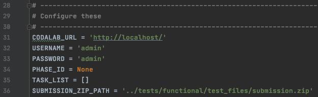

This script is designed to test the Robot Submissions feature. Robot users should be able to submit to bot-enabled competitions without being admitted as a participant.

This article will explain how to make a robot submission on your local computer, and how to present the results on the Leaderboard.

## Pre-requisite
- Python 3
- Demo bundle: autowsl
- Github download [URL](https://github.com/codalab/competitions-v2/tree/codabench/sample_bundle/src/tests/functional/test_files/AutoWSL_sample)


- Robot submission sample script here: [link](https://github.com/codalab/competitions-v2/tree/develop/docs/example_scripts)

Brief description for demo bundle:

- `code_submission`: It contains the sample bundle for the code submission and the code solution for the submission.
 - `auto_wsl_code_submission.zip`:This bundle is used for making submission.
 - `new_v18_code_mul_mul.zip`: The bundle is multiple phases, each phase has multiple tasks, and between these tasks, they share the same scoring program, that is, there is no need to copy multiple scoring program for hardcode.
 - `new_v18_code_mul_mul_sep_scoring.zip`: This bundle is multiple phases, multiple tasks under each phase share a scoring program that is exclusive to their particular phase.
 - `new_v18_code_sin_mul.zip`: This is the sample bundle of a single phase multi-task that shares the same scoring program.


- `dataset_submission`: It contains the sample bundle for data submission and the corresponding dataset solution for submission.
 - `AutoWSL_dataset_submission.zip`: This is the bundle used for dataset submissions.
 - `new_v18_dataset_mul_mul.zip`:This is a multi-phase, each phase has multiple tasks below the sample bundle, multiple tasks, using the same scoring program, do not need to copy multiple scoring program for hardcode
 - `new_v18_dataset_mul_mul_sep_scoring.zip`: This is a multi-phase, each phase has multiple tasks below the sample bundle, the task between the different phases, using a different scoring program, that is, each phase has its own independent scoring program.
 - `new_v18_dataset_sin_mul.zip`: This is a sample bundle of single-phase multi-task commit datasets.


## Getting started

### Upload a bundle
Use the sample bundle provided above to upload the bundle and create a competition


### Set the competition to allow robot submissions
On the created competition page, click the EDIT button


Then click on the Participation tab, then scroll down to the bottom and click on Allow robot submission and click SAVE button.


After the above steps are done, the Competition is allowed for making robot submission.

### Set yourself to Is bot
Go to the backend administration page, PROFILES tab bar below the user


Check the `is bot` box, click save. You can now proceed with your robot submissions.

### Change CODALAB_URL address
Change CODALAB_URL address in following scripts:`get_competition_details.py`, `example_submission.py`, `get_submission_details.py`
CODALAB_URL = 'https://www.codabench.org/'

> Find scripts at `docs/example_scripts`

### Choose the competition
Run the following command on the command line: `python3 get_competition_details.py`
What you're about to see is something like this


Choose the ID of the competition you are interested in, for example 127.


Run the script again with the competition ID as a parameter
`python3 get_competition_details.py 127`
Then you will see the following


You can select the phase ID you're interested in, then use it as the second argument and run the script again, this time you'll get the task information associated with that phase.
`python3 get_competition_details.py 127 215`


### Making submission
Inside the `example_submission.py` script, configure these options:


- `CODALAB_URL` can be changed if not testing locally.
- `USERNAME` and `PASSWORD` should correspond with the user being tested.
- `PHASE_ID` should correspond with the phase being tested on.
- `TASK_LIST` can be used to submit to specific tasks on a phase. If left blank, the submission will run on all tasks.
- `SUBMISSION_ZIP_PATH` You can fill in the absolute path of the submission directly.

The idea here is that I'm going to test all the tasks below the competition with phase ID `215`.
Then run the script.
`python3 example_submission.py`


You can see that you have successfully submitted the submission bundle.

### View submission details
Configure the` get_submission_details.py` options before running.


- `CODALAB_URL` can be changed if not testing locally.
- `USERNAME` and `PASSWORD` should correspond with the user being tested.
Run the `get_submission_details`.py script with the ID of the phase containing the desired submission as the first argument.

Since we chose `215` for our phase ID above, we'll choose `215` here.

Then run the script.
`python3 get_submission_details.py 215`


Find the ID of the desired submission. For example, `542`.

Then run the script.
`python3 get_submission_details.py 215 542`


### Finally
Finally, you can go to the competition page, add your submission, and add it to the Leaderboard!


On the Leaderboard, you can see the score details of each of your tasks.


## Using the Scripts:

### Setup:

* Create a competition with robot submissions enabled

  [Example competition bundle](https://github.com/codalab/competitions-v2/blob/develop/src/tests/functional/test_files/competition.zip)


* Create a user and enable the bot user flag on the Django admin page.


---

### get_competition_details.py:

* Inside the [`get_competition_details.py`](https://github.com/codalab/competitions-v2/blob/develop/docs/example_scripts/get_competition_details.py) script, configure these options:


* `CODALAB_URL` can be changed if not testing locally.

* Run the `get_competition_details` script with no arguments.

* Find the competition you want to test on.

* Run the `get_competition_details` script again with the competition ID as the only argument.

* Find the phase you want to test on.

* If you want to use the task selection feature, run the script again with the competition ID as the first argument and the phase ID as the second argument.

* Select the task you would like to run your submission on.

* Use the phase ID and task IDs to configure `example_submission.py`.

---

### example_submission.py:

* Inside the [`example_submission.py`](https://github.com/codalab/competitions-v2/blob/develop/docs/example_scripts/example_submission.py) script, configure these options:



* `CODALAB_URL` can be changed if not testing locally.

* `USERNAME` and `PASSWORD` should correspond with the user being tested.

* `PHASE_ID` should correspond with the phase being tested on.

* `TASK_LIST` can be used to submit to specific tasks on a phase. If left blank, the submission will run on all tasks.

* `SUBMISSION_ZIP_PATH` should be changed if testing on anything but the default "Classify Wheat Seeds" competition. An example submission can be found [here](https://github.com/codalab/competitions-v2/blob/develop/src/tests/functional/test_files/submission.zip).

* Run this script in a python3 environment with `requests` library installed.

---

### get_submission_details.py

* Configure the [`get_submission_details.py`](https://github.com/codalab/competitions-v2/blob/develop/docs/example_scripts/get_submission_details.py) options before running.


* `CODALAB_URL` can be changed if not testing locally.

* `USERNAME` and `PASSWORD` should correspond with the user being tested.

* Run the `get_submission_details.py --phase <id>` script with the ID of the phase containing the desired submission.

* Find the ID of the desired submission.

* Run the `get_submission_details.py --submission <id>` script with the desired submission ID.
   * The output of the script should be a submission object and a submission `get_details` object. This data can be used view scores, get prediction results, ect.

* Run the `get_submission_details.py --submission <id> -v` to save a zip containing previous info plus the original submission and logs.
   * `--output <PATH>` can be used to choose where to save the zip file. Otherwise, it will be saved in the current directory.
---

### rerun_submission.py
Robot users have the unique permission to rerun anyone's submission on a specific task. This enables clinicians to test pre-made solutions on private datasets that exist on tasks that have no competition.

* Configure the [`rerun_submission.py`](https://github.com/codalab/competitions-v2/blob/develop/docs/example_scripts/rerun_submission.py) options before running.


* `CODALAB_URL` can be changed if not testing locally.

* `USERNAME` and `PASSWORD` should correspond with the user being tested.

### Running the script

1. Create a competition that allows robots, and create a user marked as a robot
   user. Use that username and password below.


2. Get into a python3 environment with requests installed


3. Review this script and edit the applicable variables, like...

    ```
    CODALAB_URL
    USERNAME
    PASSWORD
    ...
    ```


4. Execute the contents of this script with no additional command line arguments with
   the command shown below:

    `./rerun_submission.py`

   The script is built to assist the user in the selection of the submission that will be re-run.


5. After selecting a submission ID from the list shown in the previous step, add that ID to
   the command as a positional argument as shown below.

    `./rerun_submission.py 42`

   The script will assist the user in the selection of a task ID.


6. After selecting both a submission ID and a task ID, run the command again with both arguments to
   see a demonstration of a robot user re-running a submission on a specific task.

   e.g.

   `./rerun_submission.py 42 a217a322-6ddf-400c-ac7d-336a42863724`
