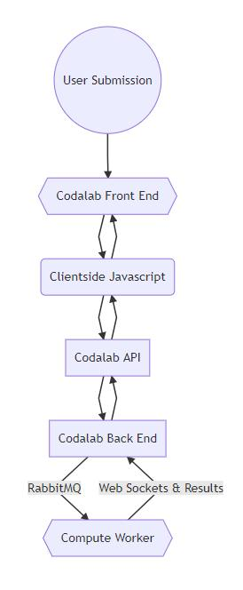

[Source](https://mermaidjs.github.io/mermaid-live-editor/#/edit/eyJjb2RlIjoiZ3JhcGggVERcbkEoKFVzZXIgU3VibWlzc2lvbikpXG5Ce3tDb2RhbGFiIEZyb250IEVuZH19XG5DKENsaWVudHNpZGUgSmF2YXNjcmlwdClcbkRbQ29kYWxhYiBBUEldXG5FW0NvZGFsYWIgQmFjayBFbmRdXG5Ge3tDb21wdXRlIFdvcmtlcn19XG5cbkEtLT5CXG5CLS0-Q1xuQy0tPkJcbkMtLT5EXG5ELS0-Q1xuRC0tPkVcbkUtLT5EXG5FLS0-fFJhYmJpdE1RfEZcbkYtLT58V2ViIFNvY2tldHMgJiBSZXN1bHRzfEUiLCJtZXJtYWlkIjp7InRoZW1lIjoiZGVmYXVsdCJ9fQ):

## Overview:
- When making a submission to Codabench, the website uses a client-side javascript to send the submission file along with proper details to an API point for submissions. 
- Once the API receives the new submission, Codabench's back-end fires off a Celery task through RabbitMQ. 
- This task is picked up by a Codabench Compute Worker listening in on the associated RabbitMQ. The Compute Worker starts processing the data. 
- The compute worker begins execution by creating the container the submission will run in using the organizer's specified docker image for the competition.
- Once the container is created, the scoring program and other necessary organizer and user supplied binaries are executed to produce results. While the submission is processing, communication back to the Codabench instance is possible through web-sockets. 
- Once the submission is done processing, it moves the output to the proper folders, and the compute worker posts these scores (if found) to the Codabench API. 
- From here, the submission is done processing and is marked as failed/finished. If at any part of the processing step (Scoring/Ingestion step of the submission) an exception is raised, the compute worker will halt and send all current output.

