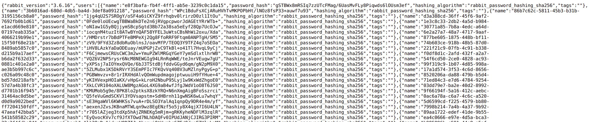

!!! note "This intervention is needed when upgrading from a version equal or lower than [v1.0.0](https://github.com/codalab/codabench/releases/tag/v1.0.0)"

## Backup RabbitMQ settings
Go to `http://<instance_ip>:<rabbitmq_admin_port>/api/definitions`   and save the response (enter login and password as configured in `.env`)

For example:



!!! warning "Do not submit any submission and wait until all submissions are processed"

## Stop and remove RabbitMQ's container and data

```bash
docker compose stop rabbit && docker compose rm rabbit
sudo rm -rvf var/rabbit/*
```

## Switch to the latest RabbitMQ version

Add `WORKER_CONNECTION_TIMEOUT=<your timeout value>` into your `.env` file with your custom value. Then execute:

```bash
git pull
docker compose build rabbit
docker compose up -d
```

## Restore the backup settings
Connect to the instance by ssh and upload your json file at 1st step, execute :

```bash
curl -u <login>:<password> -H "Content-Type: application/json" -X POST -T <your definitions file>.json http://localhost:<rabbit_admin_port>/api/definitions
```

You can check if it succeeded by doing the 1st step.

## Verify that your submission can be processed.