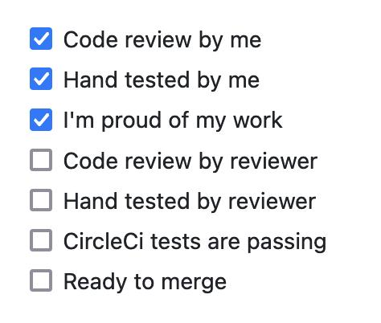
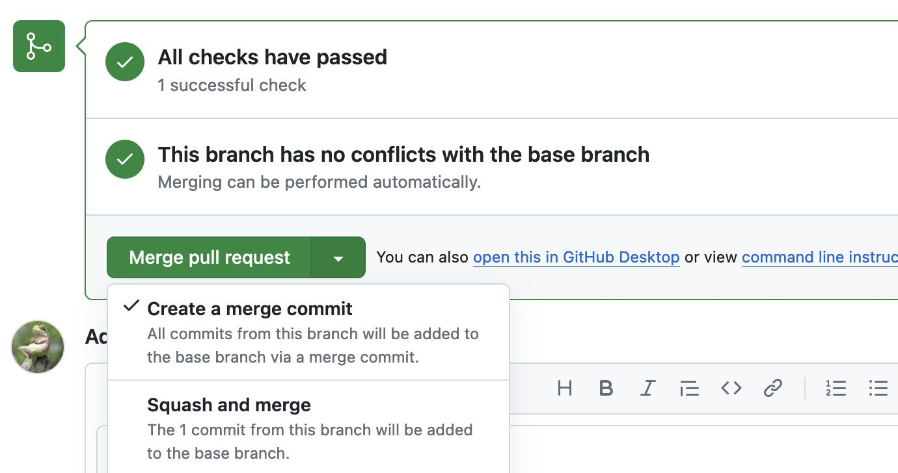
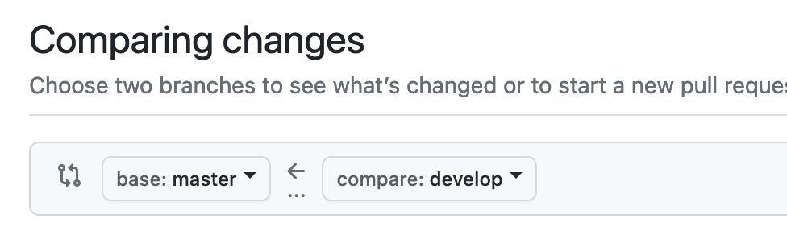
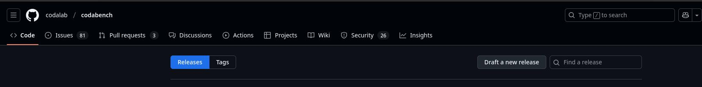
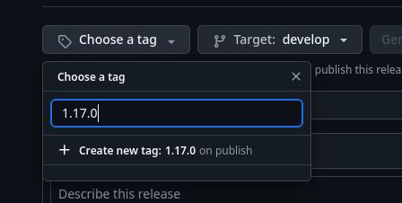
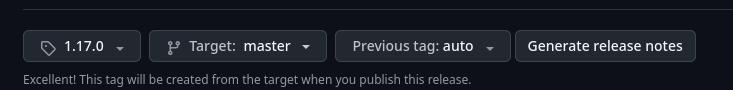
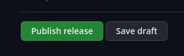

## 1. Local testing and validation of the changes

### Setup

Required:

- "Maintain" role on the repository
- A working local installation

Pull the changes, checkout the branch you are testing and deploy your local instance:

```bash
cd codabench
git pull
git checkout branch
docker compose up -d
```

If necessary, migrate and collect static files (see this [page](Codabench-Installation.md)).

!!! note 
    If the branch with the changes is from an external repository, you can create a branch in Codabench's repository and make a first merging into this new branch. Then, you'll be able to merge the new branch into master. This way, the automatic tests will be triggered.

    _EDIT: It may be possible to trigger the tests even if the branch is external. To be confirmed._

### Testing

Here is the usual checklist in order to validate the pull request:



The contributor may have provided guidelines for testing that you should follow.
In addition to this:

- Testing must be thorough, really trying to break the new changes. Try as many use cases as possible. Do not trust the contributor.
- In addition to the checklist of the PR, you can follow this checklist to check that the basic functionalities of the platform are still working: [manual validation](Manual-validation.md)

### Merging

Once everything is validated, merge the pull request.
If there are many minor commits, use "squash and merge" to merge them into one.



You can then safely click on `Delete branch`. It is a good practice to keep the project clean.


## Update the test server

Here are the necessary steps to update the Codabench server to reflect the last changes. We prodive here general guidelines that work for both the test server and the production server.

### Log into the server
```bash
ssh codabench-server
cd /home/codalab/codabench
```

Replace `codabench-server` by your own SSH host setting, or the IP address of the server.

!!! note
    Make sure to log in as the user that deployed the containers.

### Pull the last change
!!! tip
    - If you are deploying on a test server, you can use the `develop` branch.
    - If you are deploying on a Production server, we strongly adivse on using the `master` branch.

```bash
docker compose down
git status
git pull
docker compose up -d
```

### Restart Django
```bash
docker compose stop django
docker compose rm django
docker compose create django
docker compose start django
```

If `docker compose` does not exist, use `docker-compose`.

### Database migration 

```bash
docker compose exec django ./manage.py migrate
```

!!! warning "Do not use `makemigrations`"

!!! note "_Remark: [we need to solve the migration files configuration](https://github.com/codalab/codabench/issues/1109). In the meantime, `makemigrations --merge` may be needed._"

### Collect static files
```bash
docker compose exec django ./manage.py collectstatic --noinput
```

### Final testing

- Access the platform from your browser
- You may need a hard refresh (Maj + R) so the changes take effect.
- Check that everything is working fine, the new changes, and the basic functionalities of the platform


## Merge develop into master

Once some pull requests (~3 - 10) were merged into `develop`, we can prepare a merge into `master`.
Simply create a new pull request from Github interface, selecting `master` as the base branch:



In the text of the PR, link all relevant PR made to develop, and indicate the URL of the test server. 
Example: [https://github.com/codalab/codabench/pull/1166](https://github.com/codalab/codabench/pull/1166)

## Update the production server

Same procedure as [Update the test server](#update-the-test-server), but on the production server.


!!! tip
    **Do not forget to access the platform and perform a final round of live testing after the deployment.**

## Creating a Release
Once the develop branch has been merged into master, it is possible to use the Github interface to tag the commit of the merge and create a release containing all the changes as well as manual interventions if needed.

For this, you will need to go to the [release page](https://github.com/codalab/codabench/releases) and click on `Draft a new release`



Afterwards, you click on `Choose a tag` and enter the tag you want to create (in this exemple, 1.17.0 which doesn't exist yet)



You can then choose the targeted branch to create the tag on (`master` in our case) and then click on `Generate release notes`
Github will automatically generate releases based on the new commits compared to the last tag.



You can then change the text format however you like, as well as add things like Manual Intervention if there are any.

When you are done, you publish the release.



## Dockerhub Cleanup
One of the workflows of this repository creates a docker image and uploads it automatically to Dockerhub with the tag of the branch that launched the workflow.

!!! note
    If you fork the repository, you will need to link a Dockerhub account by adding the username and a docker token in the repository variables. We use [this Github Action](https://github.com/docker/login-action?tab=readme-ov-file#docker-hub) to automatically login with these variables.


These workflows launches when one of the following conditions are met :

- A change in the `Dockerfile.compute_worker` file
- A change of any file within the `compute_worker/` directory

The tag is decided by three different criterias :

- Changes on the `develop` branch creates a tag with the `test` tag
- Changes on the `master` branch creates a tag with the release tag (ex: `v1.22`)
- Changes on any other branches will create a tag with the branch name as the tag.