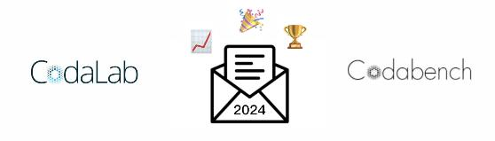
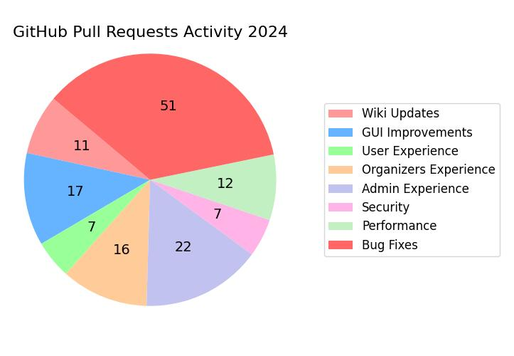
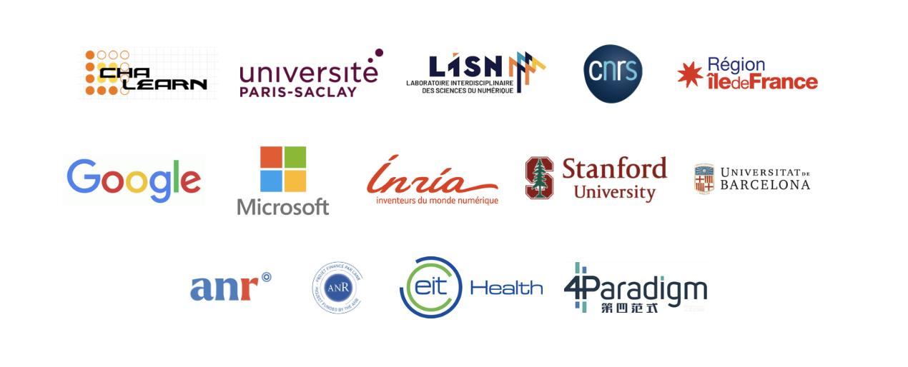

## CodaLab in 2024 
### A Year of Breakthroughs and New Horizons with Codabench

Welcome to the first edition of CodaLab’s newsletter! This year has been full of novelty, success, and scientific progress. The platform is breaking records of participation and number of organized competitions, and [Codabench](https://codabench.org/), the new version of [CodaLab](https://codalab.lisn.fr/), had a very promising launch. Let’s dive into more details.




##  Unprecedented engagement
In October, Codabench has registered its **10,000th user**! From about 100 daily submissions in January, it is now **more than 500 daily submissions** that are handled on the servers. In 2024, more than 20,000 new users have registered on CodaLab, whereas more than 12,000 on Codabench.

**249 public competitions** have been created on CodaLab, whereas **193 on Codabench: +15%** of total competitions of both platforms compared to 2023. CodaLab continues to handle a large number of submissions, as many past competitions remain active even after they have officially ended: **240,000 submissions on CodaLab** whereas **83,000 on Codabench**.

Contributors community is very active with **143 pull requests** this year. Since the platform is still relatively new, the primary focus has been on bug fixes, security and performance enhancements, and administrative features, accounting for approximately two-thirds of the pull requests. Nevertheless, we are keen on improving the experience for both participants and organizers. We have set a versioning and a release-notes follow-up to give more visibility to the platform evolution and maturity.




## Introducing Codabench
[Codabench](https://codabench.org/), the modernized version of [CodaLab](https://codalab.lisn.fr/), was released in summer 2023, and [presented at JCAD days](https://www.canal-u.tv/chaines/jcad/codalab-competitions-and-codabench-open-source-platforms-to-organize-scientific) in November 2024! Codabench platform software is now concentrating all development effort of the community. In addition to CodaLab features, it offers improved performance, live logs, more transparency, data-centric benchmarks and more!

We warmly encourage you to use [codabench.org](https://codabench.org/) for all your new competitions and benchmarks. Note that CodaLab bundles are compatible with Codabench, easing the transition, as explained in the following docs page: [How to transition from CodaLab to Codabench](../Organizers/Benchmark_Creation/How-to-transition-from-CodaLab-to-Codabench.md)

CodaLab and Codabench are hosted on servers located at [Paris-Saclay university](https://www.universite-paris-saclay.fr/), maintained by [LISN lab](http://lisn.upsaclay.fr/).


##  Spotlight on competitions
The most popular competition this year, featuring **520 participants**, was the SemEval task [Bridging the Gap in Text-Based Emotion Detection](https://www.codabench.org/competitions/3863). The task of this competition focused on identifying the emotion that most people would associate with a speaker based on a given sentence or short text snippet.

The competition with the highest reward, a **prize pool of $100,000**, was the [Global Artificial Intelligence Championships](https://www.codabench.org/competitions/2325/), track Maths 2024, a pioneering contest that aimed to advance the development of artificial intelligence tools for solving advanced mathematical problems across multiple levels of difficulty ([full report here](https://www.agiodyssey.org/pdf/GAIC_2024_Report.pdf)).

Codabench featured interesting **NeurIPS 2024 challenges**:

- The [LLM Privacy Challenge](https://llm-pc.github.io/), where participants were divided into two teams: [Red Team](https://www.codabench.org/competitions/3283/) and [Blue Team](https://www.codabench.org/competitions/3288/), each one aiming at developing attack and defense approaches for data privacy in LLMs.
- [Fair Universe - Higgs Uncertainy Challenge](https://www.codabench.org/competitions/2977/), exploring uncertainty-aware AI techniques for High Energy Physics (HEP).
- The [Concordia Challenge](https://www.codabench.org/competitions/3888/), focusing on improving the cooperative intelligence of AI systems: promise-keeping, negotiation, reciprocity, reputation, partner choice, compromise, and sanctioning.
- The [Erasing the Invisible Challenge](https://www.codabench.org/competitions/3857/), where the task is to remove invisible watermarks from images, while preserving the overall image quality.
- Codabench also hosted the [NeurIPS 2024 Checklist Assistant](https://www.codabench.org/competitions/2338/), a self-service tool for the NeurIPS 2024 checklist. This verification assistant helps authors confirm their papers’ compliance and submit improved versions based on the Assistant’s feedback. For more details check out the [blog post](https://blog.neurips.cc/2024/05/07/soliciting-participants-for-the-neurips-2024-checklist-assistant-study/) and the [experiment results](https://blog.neurips.cc/2024/12/10/results-of-the-neurips-2024-experiment-on-the-usefulness-of-llms-as-an-author-checklist-assistant-for-scientific-papers/).

Last but not least, Codabench featured several competitions in the fields of medicine and biology, such as the [Dental CBCT Scans](https://www.codabench.org/competitions/3025/), [Panoramic X-ray Images](https://www.codabench.org/competitions/3024/), [Butterfly Hybrid Detection](https://www.codabench.org/competitions/3764/), and [Monitoring Age-related Macular Degeneration Progression In Optical Coherence Tomography](https://www.codabench.org/competitions/2852/).

We’d like to thank the whole community for these exceptional scientific contributions. You can explore more challenges in the [public listing](https://www.codabench.org/competitions/public/?page=1).

## What about the future?
We always develop new features to serve the state-of-the art of Machine Learning science. We plan to invest effort in **handling medical data**, improving **federated learning** use-cases, and allowing **human-in-the loop** feedback for better AI experience.

The **platform interface will also be improved** for better visibility and facilitated re-use of datasets, tasks or solutions generated through it.

Keep in touch and give us feedback on your experience on Codabench !

## Community
Reminder on our communication tools:

- Join our [google forum](https://groups.google.com/g/codalab-competitions) to emphasize your competitions and events
- Contact us for any question: info@codabench.org
- Write an issue on [github](https://github.com/codalab/codabench) about interesting suggestions

Please cite one of these papers when working with our platforms:

```
@article{codabench,
   title = {Codabench: Flexible, easy-to-use, and reproducible meta-benchmark platform},
   author = {Zhen Xu and Sergio Escalera and Adrien Pavão and Magali Richard and
               Wei-Wei Tu and Quanming Yao and Huan Zhao and Isabelle Guyon},
   journal = {Patterns},
   volume = {3},
   number = {7},
   pages = {100543},
   year = {2022},
   issn = {2666-3899},
   doi = {https://doi.org/10.1016/j.patter.2022.100543},
   url = {https://www.sciencedirect.com/science/article/pii/S2666389922001465}
}
```

```
@article{codalab_competitions_JMLR,
 author  = {Adrien Pavao and Isabelle Guyon and Anne-Catherine Letournel and Dinh-Tuan Tran and Xavier Baro and Hugo Jair Escalante and Sergio Escalera and Tyler Thomas and Zhen Xu},
 title   = {CodaLab Competitions: An Open Source Platform to Organize Scientific Challenges},
 journal = {Journal of Machine Learning Research},
 year    = {2023},
 volume  = {24},
 number  = {198},
 pages   = {1--6},
 url     = {http://jmlr.org/papers/v24/21-1436.html}
}
```

## Last words
Thank you for reading the first edition of our newsletter. We look forward to sharing more exciting updates, competitions, and breakthroughs with you soon. Until then, keep exploring, keep competing, and stay inspired!




