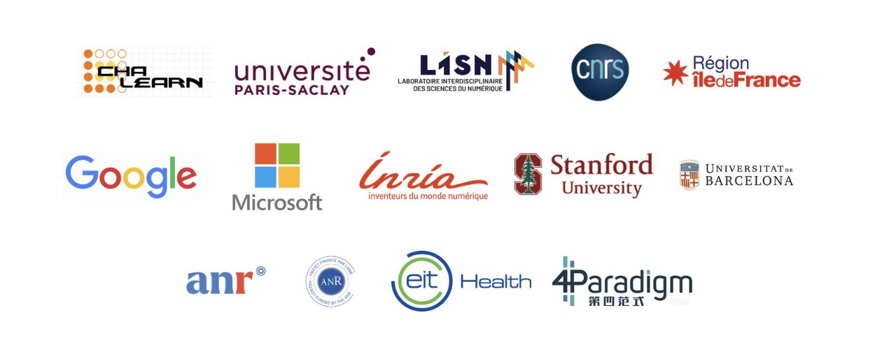

# CodaLab and Codabench newsletter

## What happened in 2025?

2025 was a year of transition — and consolidation — for our community. After 13
years of service, [CodaLab Competitions](https://codalab.lisn.fr/) was
officially phased out, closing an important chapter in the history of open
scientific challenges. At the same time, [Codabench](https://codabench.org/)
matured into the central platform for benchmarking, concentrating both usage and
development efforts.

Beyond the symbolic handover, the year was marked by strong community
engagement, growing activity on Codabench, and steady progress on the software
itself. This newsletter offers a snapshot of that journey: key numbers, standout
competitions, and the latest advances shaping the platform.


# Bye bye, CodaLab!

After 13 years and millions of submissions made,
[CodaLab Competitions](https://codalab.lisn.fr/) and its main servers were
finally phased out at end of 2025, passing the torch to
[Codabench](https://codabench.org/).

Today, Codabench is where the community's energy and development efforts are
fully focused. As a modernized evolution of the CodaLab platform, it preserves
familiar workflows while introducing improved performance, live logs, greater
transparency, data-centric benchmarks, and more.

If you haven't made the transition yet as an organizer, good news: CodaLab
bundles are fully compatible with Codabench, making the move straightforward.
The process is documented step by step here:
[How to transition from CodaLab to Codabench](https://docs.codabench.org/latest/Organizers/Benchmark_Creation/How-to-transition-from-CodaLab-to-Codabench/)

# Some statistics

Codabench continued to grow strongly throughout the year, reaching **519 public
competitions** created and welcoming **31,608 new users**! Daily activity also
increased steadily, from around 500 submissions per day in January to **over
1,000 daily submissions by December**, reflecting sustained community
engagement.

CodaLab, while entering its sunset phase, still saw **100 public competitions**
created and **14,854 new users** over the year. Submission activity peaked in
March (around 850 submissions per day), before gradually declining to fewer than
200 daily submissions in December, as usage progressively shifted towards
Codabench.

# Spotlight on competitions

2025 featured many notable competitions across scientific and industrial fields.
From NeurIPS and ICML to challenges in health and medical research,
environmental science, industrial applications, language processing, and
education, the diversity of topics continued to grow.

#### NeurIPS and ICML

- [EEG Foundation Challenge](https://www.codabench.org/competitions/9975/),
  aiming to advance the field of electroencephalogram (EEG) decoding by
  addressing two critical challenges, (1) Cross-Task Transfer Learning:
  Developing models that can effectively transfer knowledge from any cognitive
  EEG tasks to active task and (2) Subject Invariant Representation for creating
  robust representations that generalize across different subjects while
  predicting clinical factors. It was the most popular competition this year,
  featuring **1220 participants**, was the NeurIPS 2025 competition.
- [NeurIPS 2025 Weak Lensing Uncertainty Challenge](https://www.codabench.org/competitions/8934/),
exploring uncertainty-aware and out-of-distribution detection AI techniques for
Weak Gravitational Lensing Cosmology.
<!-- [NeurIPS 2025: Fairness in AI Face Detection Challenge](https://www.codabench.org/competitions/7166/),
  where the goal is to advance the development of fair and robust AI-generated
  face detection systems by addressing the critical challenge of fairness
  generalization under real-world deployment conditions.-->
- [ICML 2025 AI for Math Workshop & Challenge 1 - APE-Bench I](https://www.codabench.org/competitions/8357/),
  designed to evaluate systems that can automate proof engineering in
  large-scale formal mathematics libraries.

#### Health and medical research

- [MAMA-MIA Challenge](https://www.codabench.org/competitions/7425/), studying
breast cancer through magnetic resonance imaging (MRI) data, that turned into a
long-term benchmark.
<!-- [Universal UltraSound Image Challenge: Multi-Organ Classification and Segmentation](https://www.codabench.org/competitions/9106/),
  aiming at evaluating algorithms for multi-organ classification and
  segmentation using diverse, real-world ultrasound data collected across
  multiple centers and devices. -->
- [NSF HDR Scientific Modeling out of distribution: Neural Forecasting](https://www.codabench.org/competitions/9806/),
  in which algorithms forecast the activations of a cluster of neurons given
  previous signals from the same cluster.
- [The Algonauts Project 2025 Challenge](https://www.codabench.org/competitions/4313/),
aiming at providing a platform where biological and artificial intelligence
scientists can cooperate and compete in developing cutting-edge encoding models
of neural responses to multimodal naturalistic movies that well generalize
outside of their training distribution.
<!-- [IUGC2025-validation](https://www.codabench.org/competitions/7105/), landmark
  detection for intrapartum ultrasound measurement, aiming at improving
  childbirth experiences.-->

#### Environmental research

- [MIT ARCLab Prize for Space AI Innovation 2025](https://www.codabench.org/competitions/5547/),
  where the objective is to develop cutting-edge AI algorithms for nowcasting
  and forecasting space weather-driven changes in atmospheric density across low
  earth orbit using historical space weather observations.
- TreeAI4Species Competition:
  [Semantic Segmentation](https://www.codabench.org/competitions/9168/) and
  [Object detection](https://www.codabench.org/competitions/8485/), studying
  algorithms for identifying tree species from high-resolution aerial imagery.
- [Water Scarcity](https://www.codabench.org/competitions/4335/), leveraging
  data science to address water scarcity issues through simulations.

#### Industrial applications

- [ICPR 2026 Competition on Low-Resolution License Plate Recognition](https://www.codabench.org/competitions/12259/),
  a computer vision challenge on low resolution images which gathered more than
  500 participants.
- [AssetOpsBench](https://www.codabench.org/competitions/10206/), in which
  participants propose agents that solve realistic industrial tasks across the
  full pipeline: "Sensing → Reasoning → Actuation".
- [Universal Behavioral Modeling Data Challenge](https://www.codabench.org/competitions/7230/),
designed to promote a unified approach to behavior modeling and data analytics.
<!-- [MM-CTR: Multimodal CTR Prediction Challenge at the WWW 2025 EReL@MIR Workshop](https://www.codabench.org/competitions/5372),
  focusing on multimodal recommandation tasks.
- [WWW 2025: SMARTMEM Memory Failure Prediction Competition](https://www.codabench.org/competitions/3586/),
  where the task is to predict memory failures for data centers.
- [Inventory Control Problem](https://www.codabench.org/competitions/9675/),
  with the objective of providing agents to solve the Inventory Control Problem.
- [RoboSense - Track1](https://www.codabench.org/competitions/9285/),
  challenging participants to develop intelligent driving systems that can
  understand and act upon natural language instructions in dynamic driving
  environments. -->

#### Natural Language Processing

SemEval (Semantic Evaluation) is an international series of shared tasks in
natural language processing that provides standardized benchmarks to evaluate
and compare systems on semantic understanding challenges. More than 12 tasks
(with sub-tracks) were organized on Codabench in 2025, accounting for more than
20,000 submissions.

Some examples are given below:

- SemEval competitions suite
<!-- SemEval-2026 Task 3 - Dimensional Aspect-Based Sentiment Analysis -
  [Track A](https://www.codabench.org/competitions/10918/) -
  [Track B](https://www.codabench.org/competitions/11139/)
- [SemEval 2026 Task 4: Narrative Similarity](https://www.codabench.org/competitions/10273/)
- [SemEval 2026 Task 9 - Subtask 1: Multilingual Text Classification Challenge - Polarization Detection ](https://www.codabench.org/competitions/10522/)
- [SemEval 2025 - Task 8: DataBench, Question-Answering over Tabular Data ](https://www.codabench.org/competitions/3360/)
- [Bridging the Gap in Text-Based Emotion Detection - SemEval 2025 Task 11](https://www.codabench.org/competitions/3863/)
  -->

Other notable NLP benchmarks:

- [Behind the Secrets of Large Language Models](https://www.codabench.org/competitions/11605/)
- [VLSP2025 DRiLL shared task](https://www.codabench.org/competitions/9722/)

#### Education

- [IndoML 2025 Datathon Tack-1: Mistake Identification](https://www.codabench.org/competitions/7189/),
  a task focusing on mistake identification for education application.
- [Compétition Algorithmique Avancée CS 3A INFO -- TSP-rd](https://www.codabench.org/competitions/9896/),
a competition used as a training for students in computer science, receiving
more than 3000 submissions.
<!-- [Machine Translation Challenge! CS-779](https://www.codabench.org/competitions/10523),
  a natural language processing student competition that received more than 4000
  submissions.
- [IACV 25 - Exercise 5](https://www.codabench.org/competitions/11709), a
  competition used for image analysis and computer vision classes. -->
- [Tokam2D - Structure detection in fusion plasma simulations - datacamp 2025](https://www.codabench.org/competitions/11224/),
  physics based data science training at Université Paris-Saclay.

A huge thank you to everyone in the community for these **outstanding scientific
contributions** accros a wide variety of fields. You can discover **many more
challenges in the
[public competition listing](https://www.codabench.org/competitions/public/?page=1)**.


# Novelty in the software

Our contributors community was very active, with **139 pull requests merged**
this year. Many new features, bug fixes, and back-end changes were made. We
present some of them below.

#### New features for participants and organizers

- Public datasets listing: https://www.codabench.org/datasets/public/?page=1
- [Croissant](https://docs.mlcommons.org/croissant/) standard compatibility
- New documentation website: https://docs.codabench.org
- Users can delete their submissions and manage their individual storage
- Leaderboards are now public for everyone without login required

#### Back-end changes for developpers and hosters

- Using Playwright instead of Selenium for automatic tests
- Logs are now colored and easier to read
- Django and other packages version upgrades

#### What's to come

The trend is to make the project more easy to deploy for independant hosters.

- Unified and lighter compute worker image, making it more stable
- Make compute worker its own repository, which means it can be more easily used
  for other projects if needed
- Django Admin upgrades to make it easier to manage the website as a site admin

# Community

Reminder on our communication tools:

- Join our [google forum](https://groups.google.com/g/codalab-competitions) to
  emphasize your competitions and events
- Contact us for any question: info@codabench.org
- Write an issue on [github](https://github.com/codalab/codabench) about
  interesting suggestions

Please cite one of these papers when working with our platforms:

```
@article{codabench,
   title = {Codabench: Flexible, easy-to-use, and reproducible meta-benchmark platform},
   author = {Zhen Xu and Sergio Escalera and Adrien Pavão and Magali Richard and
               Wei-Wei Tu and Quanming Yao and Huan Zhao and Isabelle Guyon},
   journal = {Patterns},
   volume = {3},
   number = {7},
   pages = {100543},
   year = {2022},
   issn = {2666-3899},
   doi = {https://doi.org/10.1016/j.patter.2022.100543},
   url = {https://www.sciencedirect.com/science/article/pii/S2666389922001465}
}
```

```
@article{codalab_competitions_JMLR,
 author  = {Adrien Pavao and Isabelle Guyon and Anne-Catherine Letournel and Dinh-Tuan Tran and Xavier Baro and Hugo Jair Escalante and Sergio Escalera and Tyler Thomas and Zhen Xu},
 title   = {CodaLab Competitions: An Open Source Platform to Organize Scientific Challenges},
 journal = {Journal of Machine Learning Research},
 year    = {2023},
 volume  = {24},
 number  = {198},
 pages   = {1--6},
 url     = {http://jmlr.org/papers/v24/21-1436.html}
}
```

# Closing words

Thank you for reading the our newsletter. We're not done yet! More projects,
more challenges, and more science ahead. Our open platform is becoming a
powerful actor for building reliable and innovative AI benchmarks. See you on
Codabench.


