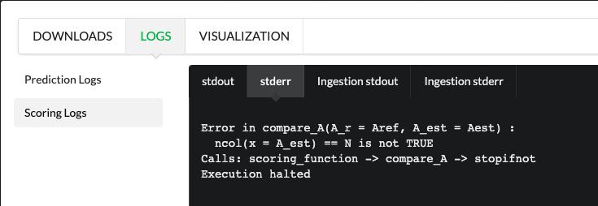

This is our use case of cancer benchmarks.
This document focuses on how to run the following three bundles in Codabench

- `CODABENCH CANCER HETEROGENEITY DT#1 TRANSCRIPTOME PANCREAS`
- `CODABENCH CANCER HETEROGENEITY DT#2 METHYLOME PANCREAS`
- `CODABENCH CANCER HETEROGENEITY DT#3 IMMUNE CELL TYPES`

## Steps
### 1. Decompressing the original bundle


Unzip the bundle from its original zip file format into a folder.

### 2. Decompressing ingestion_program_1.zip


### 3. Modify the sub_ingestion.R file in the ingestion_program_1 folder.


Add lines 19 and 20 of code, and replace the underlined variable in line 25 with submission_program_dir

Two new lines of code have been added to allow the v2 compute worker to find the user-submitted program (program.R). (Because the v2 compute worker does not support searching for user-submitted code in subfolders.)

```r
child_dir <- list.files(path=submission_program)
submission_program_dir <- paste0(submission_program, .Platform$file.sep, tail(child_dir, n=1))
```
```r
// read code submitted by the participants :
.tempEnv <- new.env( )
source(
    file  = paste0(submission_program_dir, .Platform$file.sep, "program.R")
  , local = .tempEnv
)
```


### 4.Save the changes and re-zip the ingestion_program_1 folder.
Open the command line and go to the ingestion_program_1 folder.


Use the following command to package the modified folder as a zip file
`zip -r ingestion_program_1.zip *`


Replace the latest compressed ingestion_program_1.zip file with the previous ingestion_program_1.zip file, and delete the ingestion_program_1 folder.


### 5. Recompress the modified original bundle.
Go to the directory at the same level as `competition.yaml` and execute the following command to compress the file
`zip -r Codabench_cancer_heterogeneity_DT#2.zip *`


### 6. Creating competition with compressed bundles
### 7. Modify the default execution time
The default execution time is 10 minutes, but since these three bundles are time-consuming to execute, you have to turn it up.


We recommend that you adjust the time to the maximum value of `2147483647`, so that the task will not time out and be forced to terminate by the compute worker.


## Summary
This paragraph summarizes the results of the execution of three bundles in codalab v2.
### CODABENCH CANCER HETEROGENEITY DT#1 TRANSCRIPTOME PANCREAS
[https://www.codabench.org/competitions/147/](https://www.codabench.org/competitions/147/)

All three submissions were successful.


### CODABENCH CANCER HETEROGENEITY DT#2 METHYLOME PANCREAS
[https://www.codabench.org/competitions/174/](https://www.codabench.org/competitions/174/)

Two Submissions were successfully run, while the third failed due to insufficient execution time (We have now adjusted from the original 10,000 minute execution time limit to a maximum of 2,147483647.)


### CODABENCH CANCER HETEROGENEITY DT#3 IMMUNE CELL TYPES
[https://www.codabench.org/competitions/148/](https://www.codabench.org/competitions/148/)

2 Submissions run successfully, 1 execution fails (screenshot below)


Failed execution screenshot:

