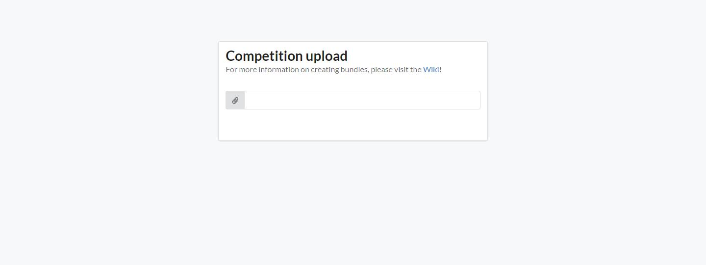
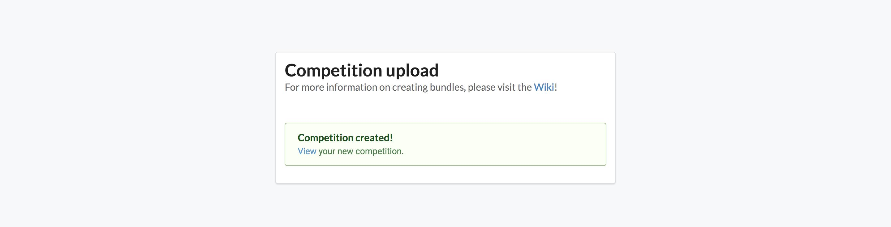

This page is relatively simple. It's where you submit a completed competition bundle to Codabench, in order for it to be processed into a competition instance. For more information on competition bundles, see this link here: [Competition Bundle Structure](https://docs.codabench.org/latest/Organizers/Benchmark_Creation/Competition-Bundle-Structure/).

To begin, just click the paper clip icon, or the bar next to it. It should open a file select dialogue. From here, you select your competition bundle, and click upload. Once Codabench is done processing and unpacking your competition, you should be greeted with a success message and a link to your new competition.

## Backward compatibility

If you previously used [CodaLab Competitions](https://github.com/codalab/codalab-competitions), note that Codabench is compatible with CodaLab bundles.
