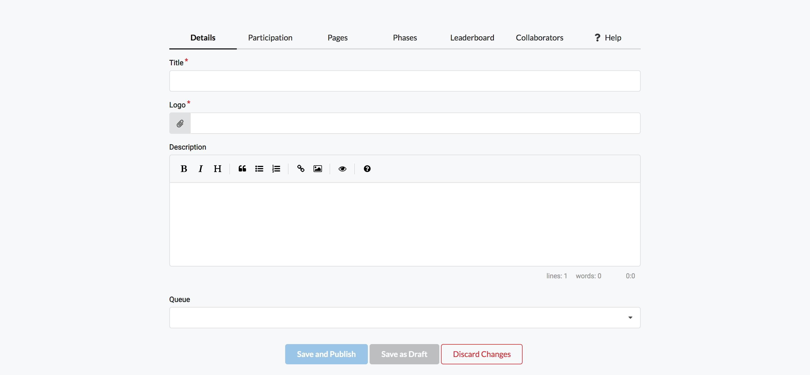
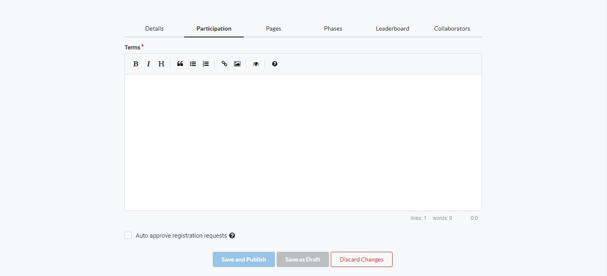
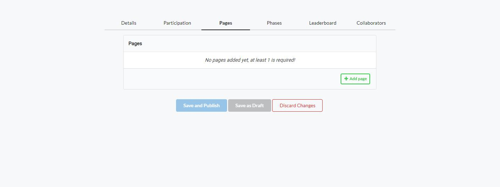
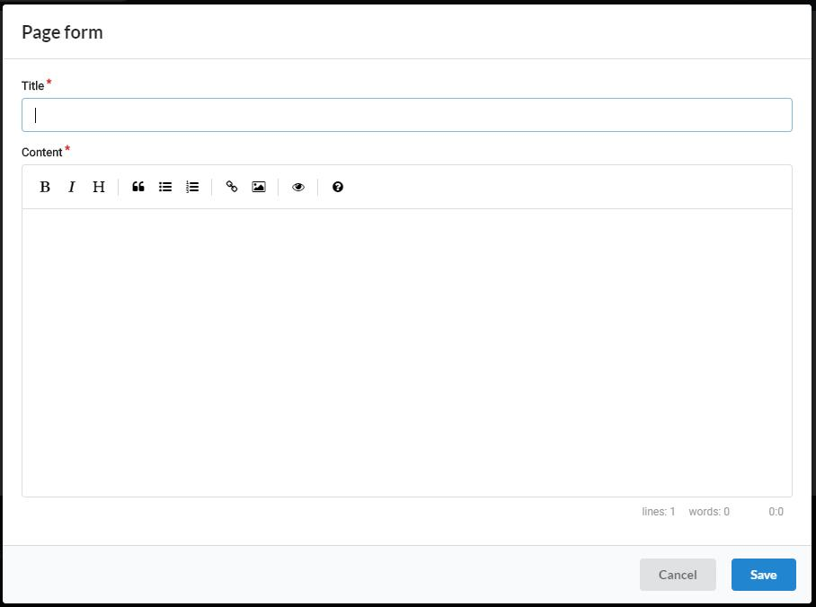
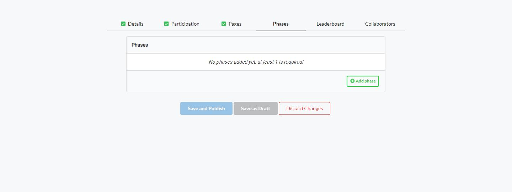
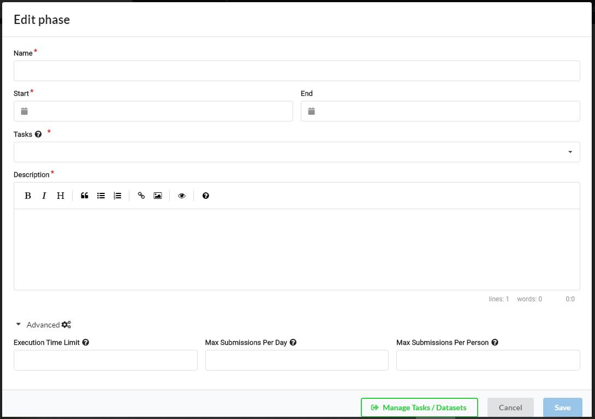
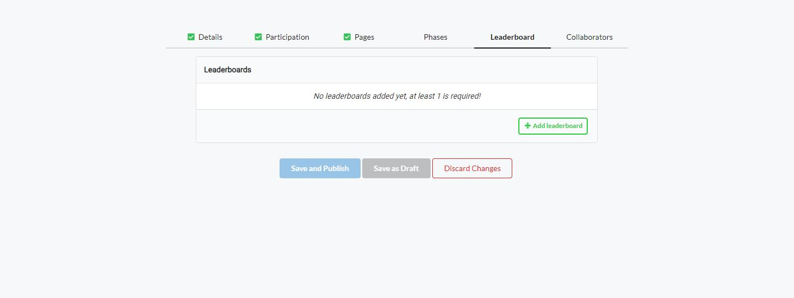
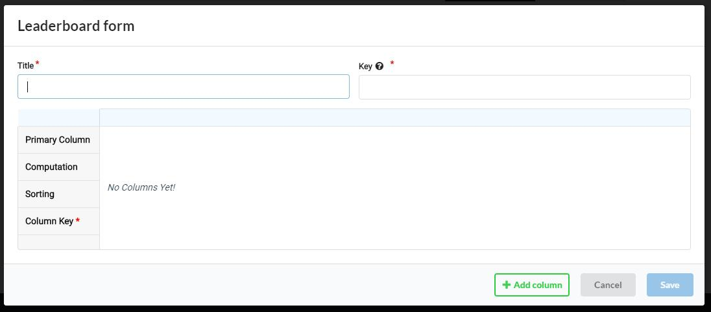
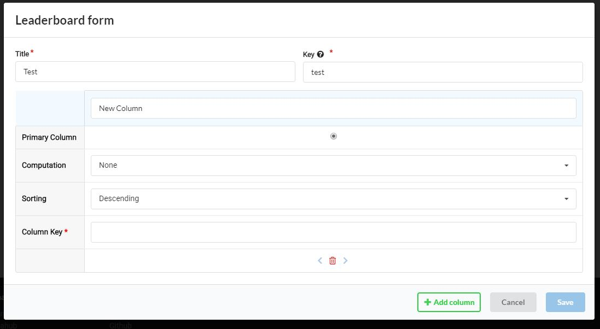
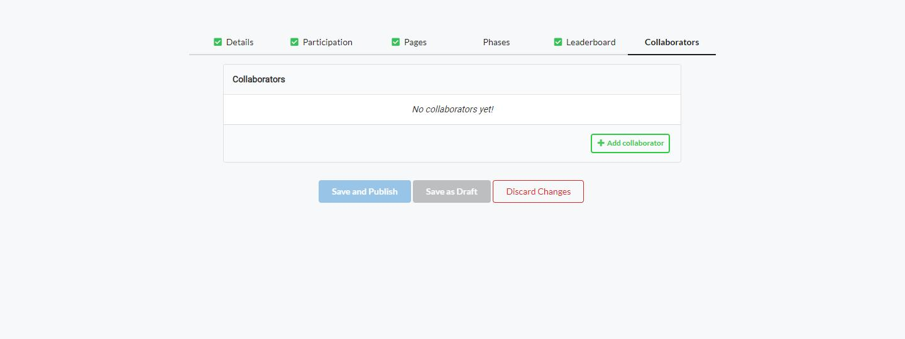

Competitions can now be created through a wizard/form. This page will cover each different tab of the competition form correlating to a section, and the fields for each section.

## Details
The details tab covers all basic competition info, such as title, logo, description, and the queue used.

- Title: The title of your competition.
- Logo: The logo corresponding to your competition
- Description: The description of your competition
- Queue: If you've previously created a queue through queue management, you can assign it to your competition here.

## Participation
The participation tab covers your terms and conditions for the competition, and settings for auto-approval of participants.

- Terms: Your terms and conditions for the competition.
- Auto Approve Registration: If checked, the organizer is not required to approve new participants.

## Pages
In the pages section, you can add any additional content you would like to display to competition participants as `pages`. (Tabs on the competition detail page).

Clicking `Add page` should present you a modal with the following layout:

- Title: The title of the page you are adding
- Content: The content of your page formatted as Markdown.

## Phases
The phases section allows you to define your phases and their attached tasks.

By clicking `Add phase`, you should be presented with a modal for phase creation:

- Name: The name of your phase
- Start: The start day of your phase
- End: The end day of your phase
- Tasks: Here you can assign one or multiple task objects to your phase. Tasks are problems that the submission should be solving. For more information, see the explanation on competition structure [here](Competition-Bundle-Structure.md#what-is-a-competition): If you don't have any tasks created yet, click the green button at the bottom of the new phase modal titled `Manage Tasks/Datasets`
- Description: The description of your phase

*Advanced*

- Execution Time Limit: The time limit for submission execution time measured in seconds (Currently the label says this is measured in MS, but this seems to be false)
- Max submissions per day: The max submissions allowed for the phase. The time period is from midnight UTC to midnight the next day UTC.
- Max submissions per person: The absolute max amount of submissions a participant can make on this phase.

## Leaderboards
The leaderboards section allows you to define leaderboards which determine how submissions are scored.

Clicking add leaderboard should bring up this modal:

- Title: The title of your leaderboard
- Key: A unique name to refer to this leaderboard by (Preferably lowercase)

Adding a column will add some fields for the values of the column:

- Title (Unlabeled top input): The title of your column
- Primary Column: Whether this is the main column in the leaderboard (I.E: Is the sum/average of other columns)
- Computation (None/Average): If average is selected, this column should not have a score submitted to it, and will be a computation of the average of all the other columns.
- Sorting: Determine which way scores are sorted for this column.
- Column Key: A unique key to refer to this column by.

## Collaborators
Here you can add other users to your competition as administrators.

As per the other pages, clicking `Add collaborator` should bring up a modal. The search text can be the user's email if you know it, or their username.

