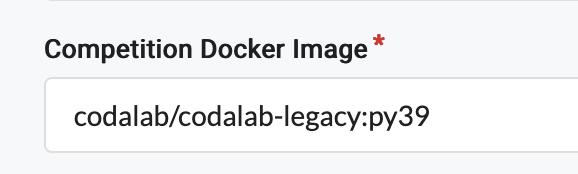

The competition docker image defines the docker environment in which the submissions of the competitions or benchmarks are run. Each competition can have a different docker environment, referred by its [DockerHub](https://hub.docker.com/) name and tag.

## Default competition docker image

The default competition docker image is `codalab/codalab-legacy:py37`. 
More information here: https://github.com/codalab/codalab-dockers

## Set up another image

You can select another docker image:

- In the `competition.yaml` file, using `docker_image: username/image:tag`
- In the editor field "Competition Docker image" as shown in the following screenshot:

## Building an image

If the default image does not suit your needs (missing libraries, etc.), you can either:

- Select an existing image from DockerHub
- Create your own image from scratch
- Create a custom image based on the Codalab image. (more information below)

If you wish to create a custom image based on the Codalab image, you can follow the steps below:

1) Install Docker  
2) Sign up to DockerHub  
3) `docker run -itd -u root codalab/codalab-legacy:py39 /bin/bash`  
4) Use `docker ps` to find running container id  
5) Now run `docker  exec -it -u root <CONTAINER ID> bash`  
6) Install anything you want at the docker container shell (`apt-get install`, `pip install`, etc.)  
7) Exit the shell with `exit`  
8) `docker commit <CONTAINER ID> username/image:tag`  
9) `docker login`  
10) `docker push username/image:tag`  