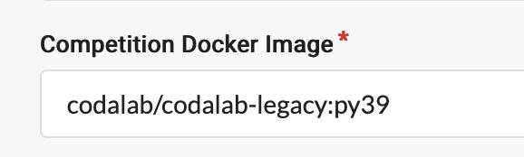

The competition docker image defines the docker environment in which the submissions of the competitions or benchmarks are run. Each competition can have a different docker environment, referred by its [DockerHub](https://hub.docker.com/) name and tag.

## Default competition docker image

The default competition docker image is `codalab/codalab-legacy:py37`. 
More information and base images are available here: https://github.com/codalab/codalab-dockers


## Set up another image

You can select another docker image:

- In the `competition.yaml` file, using `docker_image: username/image:tag`
- In the editor field "Competition Docker image" as shown in the following screenshot:


If the default image does not suit your needs (missing libraries, etc.), you can either:

- Select any existing image from DockerHub
- Create your own image from scratch
- Create a custom image based on the CodaLab image (more information below)

## Custom image based on CodaLab image

If you wish to create a custom image based on the Codalab image, you can follow the steps below:

#### Preliminary steps

1) Install Docker
2) Sign up to [DockerHub](https://hub.docker.com/)  

#### Method 1: update the image from a container

1) Start a container using the base image:
```sh
docker run -itd -u root codalab/codalab-legacy:py39 /bin/bash
```
2) Identify the running container ID using `docker ps`
3) Enter inside the container:
```sh
docker  exec -it -u root <CONTAINER ID> bash
```  
4) Install anything you want at the docker container shell (`apt-get install`, `pip install`, etc.)  
5) Exit the shell with `exit`  
6) Push the new version to your DockerHub account:
```sh
docker commit <CONTAINER ID> username/image:tag
docker login
docker push username/image:tag
```

#### Method 2: update the Dockerfile and re-build

1) Download the Dockerfile of the base image:
https://github.com/codalab/codalab-dockers/blob/master/legacy-py39/Dockerfile

2) Edit the file to include any library or program you need

3) Build the image
```sh
docker build -t username/image:tag .
```

4) Push it to your DockerHub account

```sh
docker login
docker push username/image:tag
```