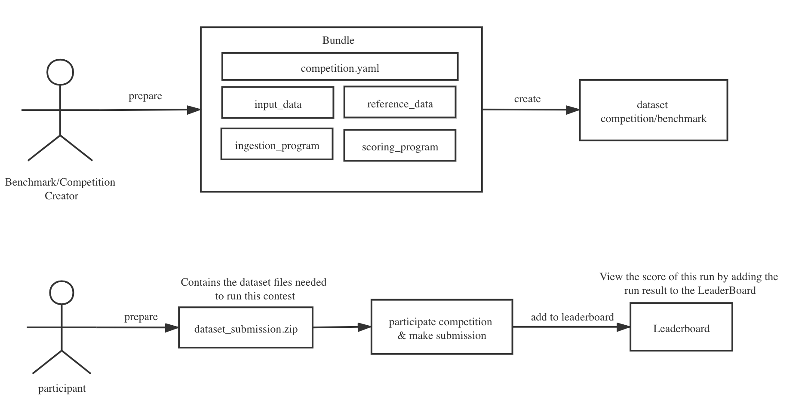
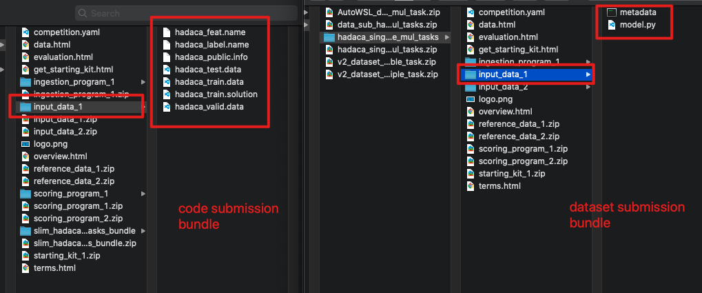
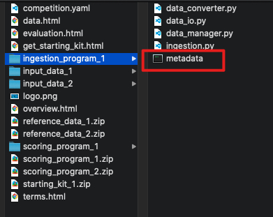
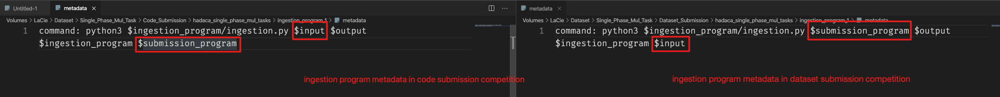
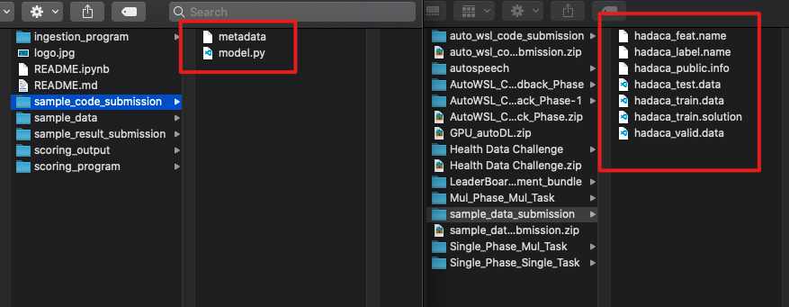

This page focuses on how to create a dataset contest via bundle and make submission for dataset competition

## Overall process
The brief process can be summarized in the following diagram

There are two main parts:
- the contest organizer creates the dataset competition by uploading a bundle (For more information on how to create a contest via bundle, and the definition of bundle, you can refer to this link [Competition-Creation-Bundle](https://docs.codabench.org/latest/Organizers/Benchmark_Creation/Competition-Creation-Bundle/))

- Competition participant submission dataset

## Differences from the code submission competition
### For the competition creator
The main difference is the definition of the bundle, which differs from the code commit bundle in 2 ways

#### Input data

- In the code submission, input data folder is filled with the dataset files

- In the dataset submission, input data folder is filled with the sample code submission files(NB: the sample code submission file is the algorithm file to be submitted by the participants in the code submission.)

#### Ingestion program

- Unlike the code submission, we need to switch the position of the variables $input and $submission_program
- In a dataset submission competition, the contents of $submission_program is the dataset submitted by the participant, and the contents of $input is the competition creator's built-in sample code submission.

## For the competition participant

- The left-hand side of the image above shows the contents of the documents that competition participants need to prepare for the code submission competition

- the right-hand side of the image above shows the contents of the documents that competition participants need to prepare for the dataset submission competition

- The competition creator needs to define the bundle by specifying the content of the dataset file to be uploaded 

- For example, the right-hand side of the picture shows the contents of the dataset file required for the HADACA competition to run.

- Therefore, when competition participants upload their dataset submission, the zip file must contain all the files shown on the right side of the picture above.

