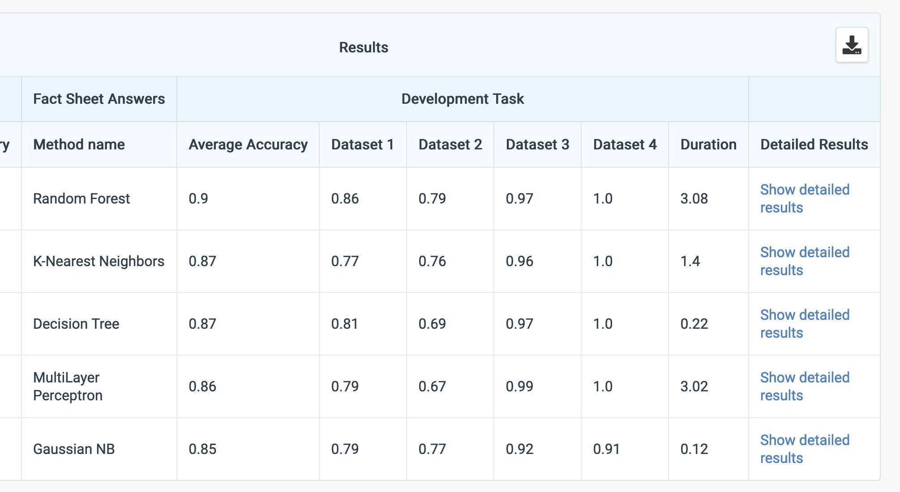
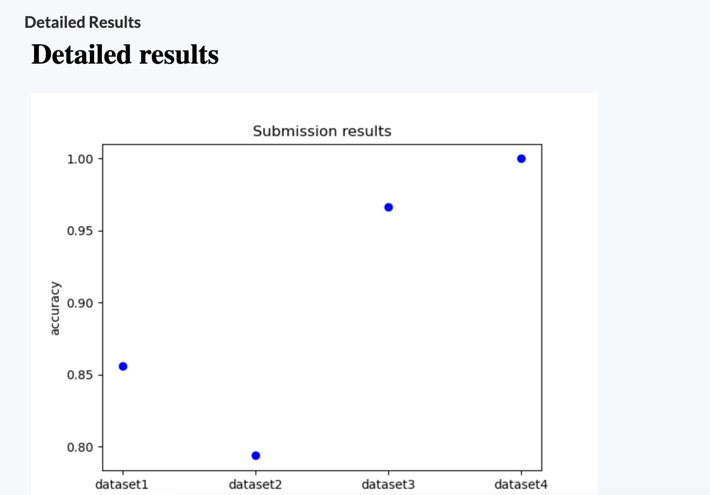

Detailed results is a means of passing extra information from the scoring program to the frontend.

This is done via writing to a `detailed_results.html` file (OR any `.html` -- first by alphabetical order -- in the output folder), and setting `enable_detailed_results` to `True` in competition settings (via yaml or editor). 

This file is watched for changes and updated on the frontend every time the file is updated, so users can get a live feed from the compute worker.

There is no limitation to the contents of this HTML file, and can thus be used to relay any information desired.
Use case ideas:

- Plot data using a python plot library like matplotlib or seaborn.
  - plot the learning curve over time of a reinforcement learning challenge
  - plot the slope of a linear regression model
  - plot the location of clusters in a classification challenge
  - plot anything you can conceive of
- Run a profiler that outputs a network of method calls. 
- Display any additional data about the submission file that can not be distilled down in to a score of some kind

## How to include figures

Figures can be included directly inside the HTML code, by converting them in bytes format. An example is given in the [scoring program of the Mini-AutoML bundle](https://github.com/codalab/competition-examples/blob/master/codabench/mini-automl/bundle/scoring_program/scoring.py).

```python title="scoring.py" 
[...]

# Path
input_dir = '/app/input'    # Input from ingestion program
output_dir = '/app/output/' # To write the scores
reference_dir = os.path.join(input_dir, 'ref')  # Ground truth data
prediction_dir = os.path.join(input_dir, 'res') # Prediction made by the model
score_file = os.path.join(output_dir, 'scores.json')          # Scores
html_file = os.path.join(output_dir, 'detailed_results.html') # Detailed feedback

def write_file(file, content):
    """ Write content in file.
    """
    with open(file, 'a', encoding="utf-8") as f:
        f.write(content)

def make_figure(scores):
    x = get_dataset_names()
    y = [scores[dataset] for dataset in x]
    fig, ax = plt.subplots()
    ax.plot(x, y, 'bo')
    ax.set_ylabel('accuracy')
    ax.set_title('Submission results')
    return fig

def fig_to_b64(fig):
    buf = io.BytesIO()
    fig.savefig(buf, format='png')
    buf.seek(0)
    fig_b64 = base64.b64encode(buf.getvalue()).decode('ascii')
    return fig_b64

def main():
    # Initialized detailed results
    write_file(html_file, '<h1>Detailed results</h1>') # Create the file to give real-time feedback

    [...] # compute the scores

    # Create a figure for detailed results
    figure = fig_to_b64(make_figure(scores))
    write_file(html_file, f'')
```

## Example

When the visualization is enabled, a link to the detailed results can be found on the leaderboard for each submission: 



The `detailed_results.html`, generated by the scoring program, is then shown:



