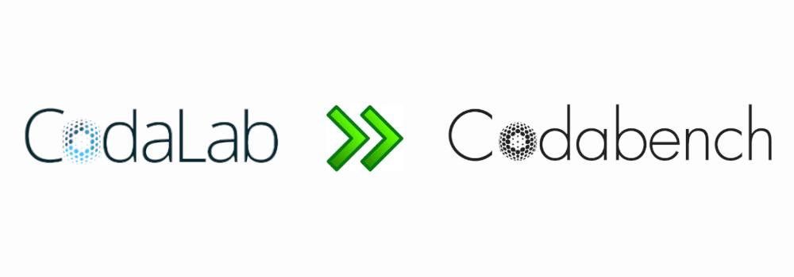
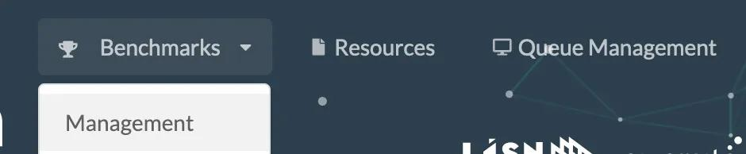
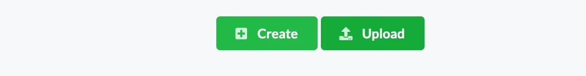
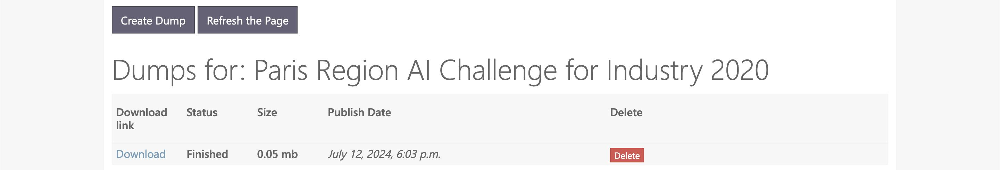

[Codabench](https://codabench.org/) serves as a modern, faster, and more reliable upgrade to [CodaLab](https://codalab.lisn.fr/), designed to supersede it. This quick guide is meant for CodaLab users wondering how to successfully adopt this new challenge platform.

## What’s new in Codabench?

[Codabench](https://codabench.org/) includes all features from [CodaLab Competitions](https://codalab.lisn.fr/), and proposes a faster and more intuitive interface. It also has new features such as:

- Live logs during submission processes
- Storage quotas 
- [Computation servers management](../Running_a_benchmark/Server-status-page.md) for all users. 

It also emphasizes on benchmarking, allowing dataset submissions and multiple leaderboard rows per user. Finally, future project development and maintenance will be focused on Codabench.

## Do I need to create a new account?

Yes, even if you previously had a CodaLab account, you need to [create a new account](https://www.codabench.org/accounts/signup) on Codabench. Sign up is quick and free. From there, as a competition participant, you are all set. 

The next questions concern competition organizers.

## Can I upload my old competition bundles to Codabench?

Yes! That is the good news: competition bundles are back-compatible. This means that you can upload your CodaLab competition bundles into Codabench without any modifications and have them working just fine.

Simply go to “_Benchmarks > Management_”, then click on “_Upload_” and select your competition bundle.

_Go to “Benchmarks > Management”._

_Click on “Upload” and select your competition bundle._

That’s it! Your competition is ready to receive submissions.

## How to move a competition from CodaLab to Codabench?

If you competitition is already live on CodaLab, that is fine too. You simply need to create a dump, download it and re-upload it on Codabench.

_Go to “Dumps” organizer interface._

_Click on “Create Dump” then “Download”. You’ll obtain a competition bundle that you’ll be able to re-upload on Codabench, following the instructions of the previous section._

!!! note "Leaderboard results won’t be transferred. For that, you’ll need to re-submit the submissions."

## How to create a competition from scratch on Codabench?

If you don’t have any previous competition, and want to learn how to create one from scratch, please refer to the [Getting started guide](Getting-started-with-Codabench.md).

## Concluding remarks

Codabench, the new version of the competition and benchmark platform CodaLab, was launched on August 2023 and is already receiving great attention. For users accustomed to CodaLab, the transition to Codabench is quick and easy. Indeed, competition bundles are back-compatible, and all that is required is to create an account on Codabench. To go further, you can refer to [Codabench’s Docs](https://docs.codabench.org).

