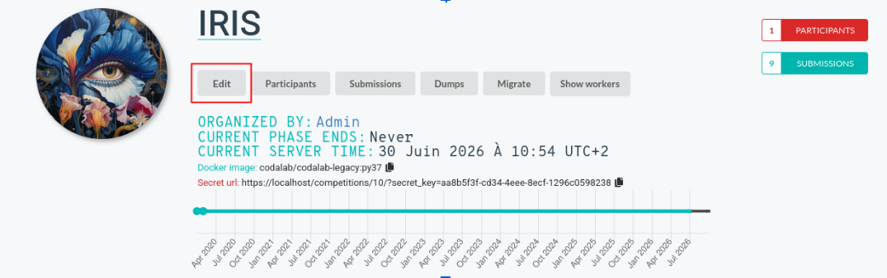
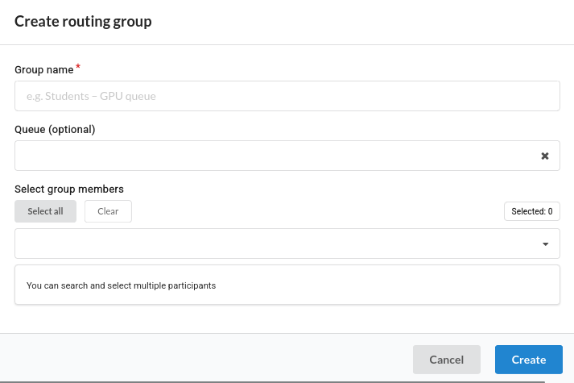

## Overview

The **Participant Routing** feature allows competition organizers to group participants and associate a compute queue with each group.

When a participant submits a submission, Codabench automatically routes it to the compute queue(s) associated with the participant's groups.

This feature enables organizers to:

- Route different participants to different compute infrastructures (dedicated GPU servers, university clusters, private cloud, etc.).
- Compare the same participant's results across multiple infrastructures.
- Isolate specific participant groups (students, partners, internal teams, etc.) on dedicated compute resources.
- Combine participant routing with multi-task competitions.

# Managing Participant Groups

## Accessing the Group Management Interface

1. Open the competition edit form.



2. Navigate to the **Participation** tab.


3. Scroll down to the **Groups** section.


---

## Creating a Group

Click **New Routing Group**.

Fill in the following fields:



| Field                  | Description                                                                                                                                                |
| ---------------------- | ---------------------------------------------------------------------------------------------------------------------------------------------------------- |
| **Group Name**         | Display name shown in the leaderboard. Must be unique within the competition.                                                                              |
| **Queue** _(optional)_ | Compute queue where submissions from this group will be routed. Use the search field to filter queues. Leave empty to use the competition's default queue. |
| **Members**            | Approved competition participants to include in the group. Search by username or email.                                                                    |

Click **Create**.

---

## Deleting a Group

!!! Warning
    Deleting a participant group is **permanent**.

Existing submissions are **not** modified after a group is deleted.

---

# Submission Routing Rules

## Queue Priority

Routing follows the following priority:
!!! Tip
    ```title="Queue priority"
    Group Queue
        ↓
    Competition Queue
        ↓
    Default Celery Queue
    ```

---

## Routing Trigger

Participant routing is enabled **only if the participant belongs to at least one group**.

A group **without a queue** means:

!!! Tip
    Use the competition's default queue.

## Queue Deduplication

If multiple groups reference the **same compute queue**, only **one child submission** is created.
Duplicate submissions are never generated for the same queue.

# Leaderboard Behavior

When participant groups affect routing, the leaderboard adapts automatically.

## Group Column

A new **Group** column appears whenever at least one routed group is involved.
It displays the participant group associated with each leaderboard entry.
If no routed group is involved, the leaderboard behaves exactly as before and the column is hidden.

---

## Multi-task Competitions

For a given root submission:

- Child submissions executed on the **same queue** are merged into a single leaderboard row.
- Child submissions executed on **different queues** appear on separate rows.

---

## Example

One participant belongs to two groups routed to different queues.
Two competition tasks are defined.

```title="Leaderboard"
Task:               Task 1               Task 2
---------------------------------------------------------
#  Participant   ID   Group    Score     Score
1  alice         201  GPU      0.92      0.81
2  alice         203  CPU      0.76      0.70
```

---

# Routing Scenarios

| Participant configuration                         | Group queues | Competition queue | Child submissions created         | Leaderboard rows | Group column |
| ------------------------------------------------- | ------------ | ----------------- | --------------------------------- | ---------------- | ------------ |
| No group, single-task competition                 | —            | Q0                | 1 root submission executed on Q0  | 1                | ❌           |
| No group, multi-task competition                  | —            | Q0                | N child submissions on Q0         | 1                | ❌           |
| One group without queue, single-task              | Default      | Q0                | 1 root submission on Q0           | 1                | ❌           |
| One group without queue, multi-task               | Default      | Q0                | N child submissions on Q0         | 1                | ❌           |
| One group with queue, single-task                 | Q1           | Q0                | 1 child submission on Q1          | 1                | ✅           |
| One group with queue, multi-task                  | Q1           | Q0                | N child submissions on Q1         | 1                | ✅           |
| One routed group + one default group, single-task | Q1 + Default | Q0                | 2 child submissions (Q1 + Q0)     | 2                | ✅           |
| One routed group + one default group, multi-task  | Q1 + Default | Q0                | 2 × N child submissions           | 2                | ✅           |
| Two groups with different queues, single-task     | Q1 + Q2      | Q0                | 2 child submissions               | 2                | ✅           |
| Two groups with different queues, multi-task      | Q1 + Q2      | Q0                | 2 × N child submissions           | 2                | ✅           |
| Two groups using the same queue                   | Q1 + Q1      | Q0                | 1 child submission (deduplicated) | 1                | ✅           |
| K groups with distinct queues                     | Q1...QK      | Q0                | K × N child submissions           | K                | ✅           |

---

# Important Notes

!!! Notes
    Removing a participant from a group **after** a submission has been created does **not** modify existing submissions.
    If the queue associated with a group is deleted after submissions have been created, the leaderboard displays **"—"** in the **Group** column for those entries.

---

!!! Notes
    Re-running a submission recomputes participant routing using the participant's **current group memberships**.

If group assignments have changed since the original submission, the rerun may produce different child submissions.

---

!!! Info
    Group names are unique **within a competition**.

Different competitions may use identical group names without conflict.
