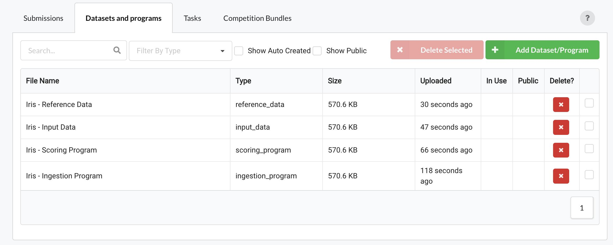
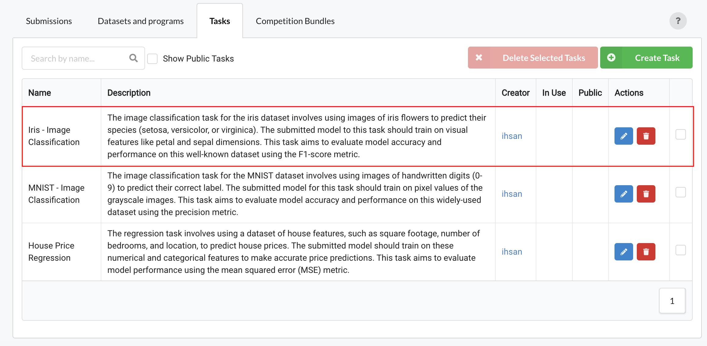
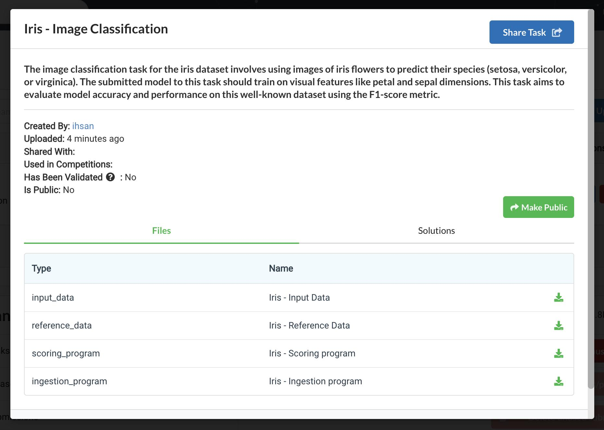
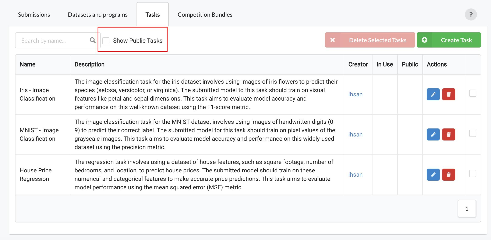
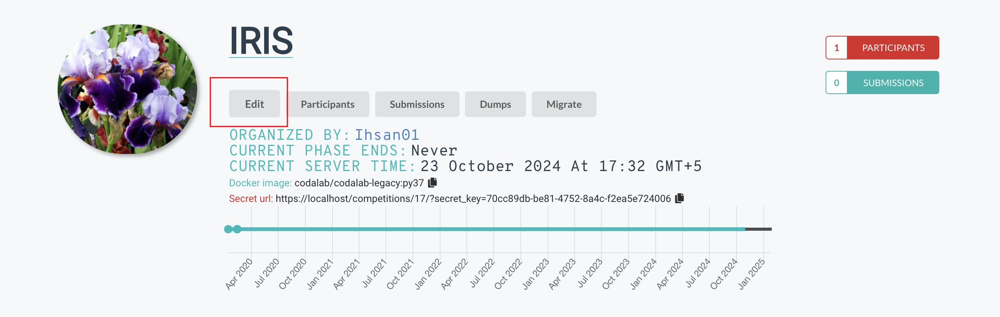
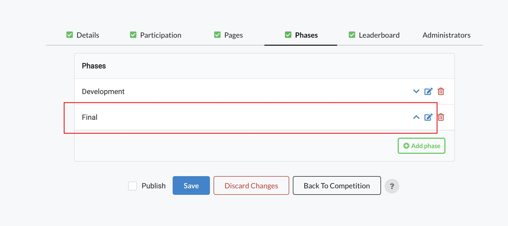
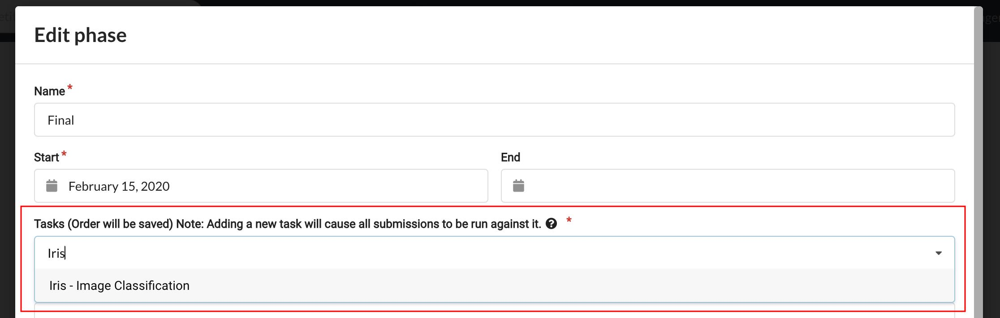

Codabench tasks are a combination of datasets and programs:

- Scoring program 
- Ingestion program
- Input data
- Reference data

A scoring program is required while others are optional in a task.

In the [Codabench Resources Interface](https://www.codabench.org/tasks/) you can upload datasets and programs in the `Datasets & Programs` tab and then create a task in the `Tasks` tab.

**Example of uploaded datasets and programs:**

**Example of a task created using the above datasets and programs:**

## Make a Task Public

You can make a task public that you have created by clicking on the task name to show task details and then click the button `Make Public`

### Example of task details:

## Search Public Tasks

To search public tasks, you can check the `Show Public Tasks` to view public tasks from other users

## Use Public Tasks in Competitions

You can use public tasks created by other people in your competitions, to do this follow the steps below:

1. Open your competition and click `Edit` button

2. Click the `Phases` tab and click the edit button in front of the phase where you want to use a public task

3. Start writing the task name in the Tasks field and the matching task will show up. Click the task in the list to select it

