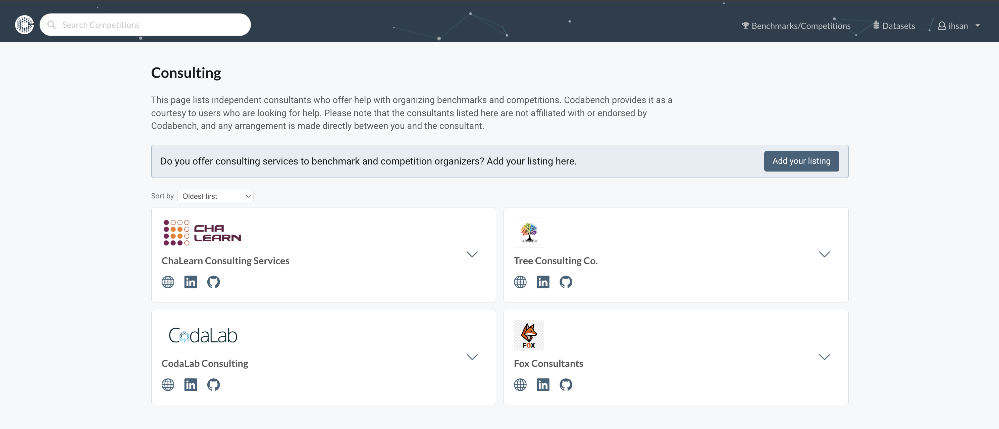
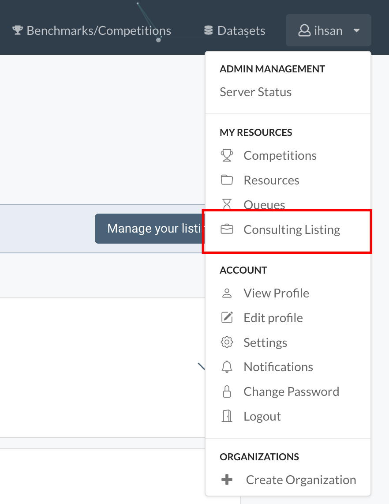
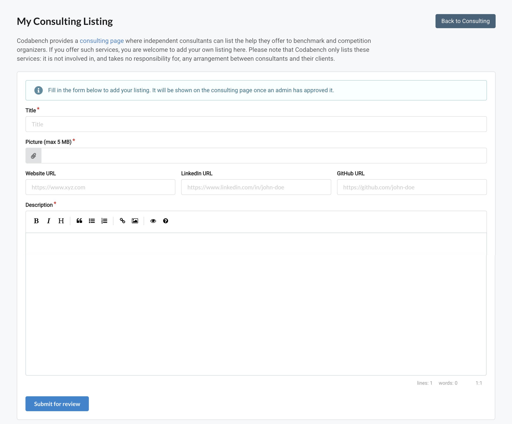

The consulting page lists independent consultants who offer help with organizing benchmarks and competitions. Anyone can browse it, and any logged-in user who offers such services can add their own listing.

!!! note
    Codabench provides this page as a courtesy to users who are looking for help. The consultants listed are not affiliated with or endorsed by Codabench. Any arrangement is made directly between you and the consultant, and Codabench is not involved in it and takes no responsibility for it.

## Finding a consultant

The consulting page is available at `/consulting/` on the platform, for example [https://www.codabench.org/consulting/](https://www.codabench.org/consulting/).

Each consultant is shown as a card with:

- a picture,
- a title,
- icons linking to their website, LinkedIn and GitHub (only the links they provided).

Click the arrow on a card to open the full description. Click it again to close it.

Use **Sort by** above the list to change the order:

- `Oldest first` (default): listings in the order they were added
- `Newest first`: most recently added listings first
- `Alphabetical (A-Z)`: by title

The list shows 20 listings per page.

## Adding your listing

You need to be logged in. Open your listing page either from the user menu in the top right corner (**My Resources** > **Consulting Listing**), or with the **Add your listing** button on the consulting page.

Fill in the form:

- **Title** (required): the name shown on your card, up to 150 characters.
- **Picture** (required): an image of at most 5 MB. It is shown whole on your card, never cropped.
- **Website URL**, **LinkedIn URL**, **GitHub URL** (optional): shown as icons on your card.
- **Description** (required): the text shown when your card is opened. It is written in Markdown, and the editor has a preview button.

Then click **Submit for review**.

!!! note
    Each user can have one listing.

## Review

A new listing is not shown publicly right away. It is `pending` until a platform administrator has reviewed it:

- If it is **approved**, it appears on the consulting page and you receive an email.
- If it is **rejected**, you receive an email with the reason. The reason is also shown on your listing page. You can edit the listing and submit it for review again.

## Editing your listing

Open your listing page from the user menu, or with the **Manage your listing** button on the consulting page.

- While the listing is **pending**, it cannot be edited. The page shows your listing as it was submitted.
- Once it is **approved** or **rejected**, change anything in the form and click **Save and resubmit for review**. The button is only enabled when something has changed.

!!! warning
    Any edit sends the listing back for review. An approved listing is hidden from the consulting page until an administrator approves it again.

## Removing your listing

On your listing page, click **Remove listing** in the red box at the bottom. This permanently deletes the listing and its picture, and cannot be undone. You can add a new listing afterwards.

## Deactivated listings

A platform administrator can deactivate a listing. A deactivated listing is not shown on the consulting page, even if it is approved, and your listing page tells you so. You can still edit or remove it. Contact the platform administrators if you want it to be shown again.
