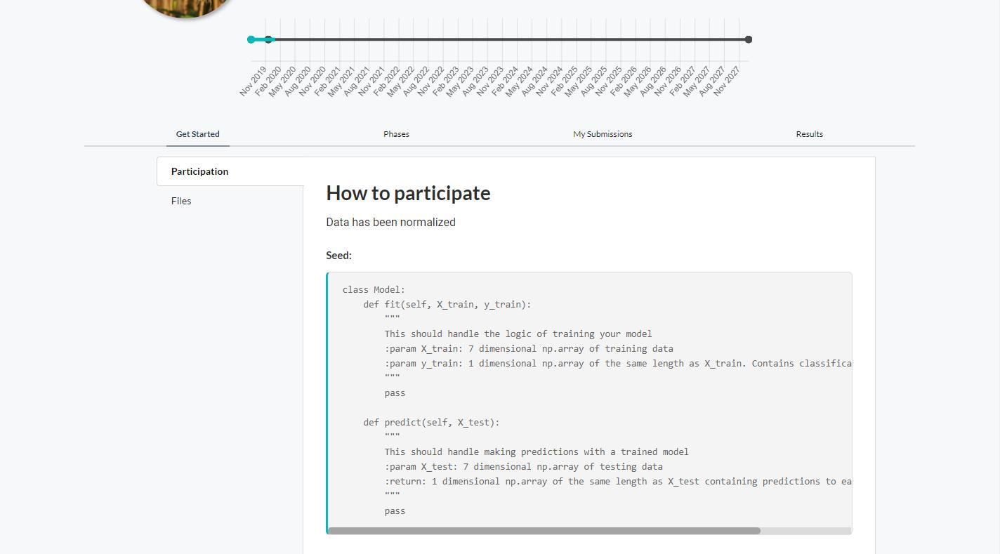

The competition detail page is the main way to interact with competitions. This is where your participants (Or if you are a participant) will read the pages you uploaded, register, make submissions, and check results.

1) Editor (organizer feature)  
2) Copy competition secret URL (Document icon, secret URL covered)  
3) Competition Detail Tab Navigation  

   - Get Started
   - Phases
   - My Submissions
   - Results
   - Forum (if enabled)

4) Competition Detail Tab Pane Navigation  

## Competition organizer features

These features are only for competition organizers.

- Editor
- Manage participants
- Manage submissions
- Manage dumps (save the current state of the competition as a bundle)
- Migration

### Submissions

From here, you can:
 - Delete submissions
 - Re-run submissions
 - Set a submissions score
 - Force a submission to leaderboard

You can also view the logs, and all output associated with a submission.

- Download CSV: Download a CSV file with all submission info
- Re-run all submissions per phase: Re-runs all submissions in a phase.
- Search: Used to search for a submission by file name
- Phase: Used to filter submissions by phase
- Status: Used to filter submissions by status
- Action Buttons:
   - Blue Circular Arrow: Re-runs the submission
   - Yellow Cross: Cancels the current submission if it is running
   - Red Trash Can: Deletes the submission
   - Green arrow: Puts this submission on the leaderboard

### Participants

From here, you should be able to:
 - Email all participants
 - Approve/Deny participants
 - Revoke participants

- Search: Search for a participant by username or email address.
- Status: Filter participants by status
- Email Participants: Opens a modal to email all participants:
   - Subject: The email subject
   - Content: The email content

### Copy competition secret URL
Clicking the document icon copies the competition secret URL to your clipboard.

# Competition Detail Tab Navigation
Used to navigate between the different sections of the competition detail page.

### Get Started
Contains all the organizer made pages, and some defaults.

### Phases
Contains a diagram list with details on each phase in the order in which they're active.

### My Submissions
This view contains a table with all your submissions, and allows you to upload new ones.

### Results
This view contains the leaderboard results.

