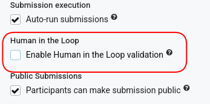
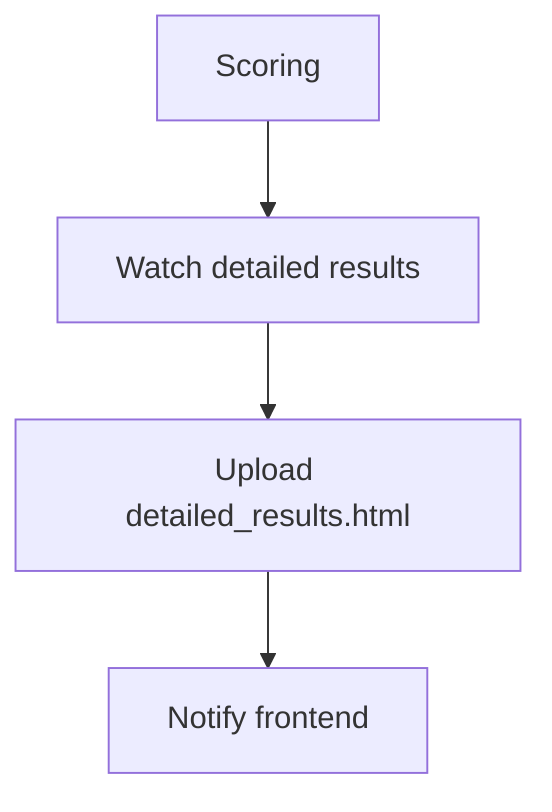
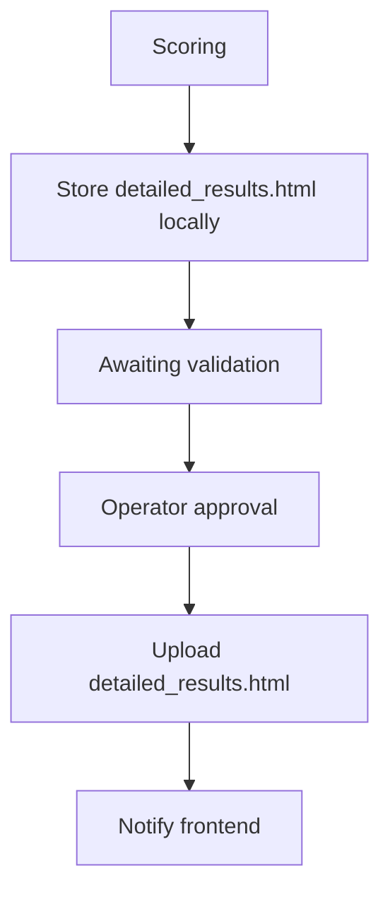

# Human-in-the-Loop (HITL)

## Introduction

The **Human-in-the-Loop (HITL)** feature introduces a manual validation step into the Codabench submission workflow.

When enabled, the Compute Worker executes the submission normally but **does not immediately publish the scoring results**. Instead, execution pauses after the scoring program has completed and waits for a human operator to explicitly approve or reject the submission.

This mechanism is intended for competitions where the scoring results must be reviewed before being published, such as:

* Medical AI competitions
* Security-sensitive evaluations
* Competitions involving confidential data
* Any evaluation requiring manual verification from compute worker side

---

## Objectives

The HITL feature guarantees:

* the submission is fully executed before any result is published.
* no score appears on the leaderboard before validation.
* no detailed results are available before validation.
* no output archive is sent back to instance.
* the operator can approve or reject the submission directly from the Compute Worker.

---

## Scope

The HITL feature applies **only to private Compute Workers**.

---

## Activation

### Competition configuration

Each competition exposes the following option:

When enabled, every submission routed to a private Compute Worker is executed in HITL mode.


---

### Compute Worker configuration

Each Compute Worker may enable HITL support using its `.env` file.

``` title="Option"
HUMAN_IN_THE_LOOP=true
```

If the variable is omitted, the Compute Worker behaves as a standard worker.
The absence of the variable is interpreted as **False**, ensuring full backward compatibility with existing Compute Workers.

---

## Safety checks

To prevent configuration errors, the Compute Worker verifies that both sides agree on the HITL configuration.
The Site Worker includes the following field in every Celery task.

Before starting the execution, the Compute Worker compares:

* task `human_in_the_loop` Codabench side.
* local `.env` variable `HUMAN_IN_THE_LOOP` Compute worker side.

---

### Mismatched configuration

The submission is immediately rejected.
The Compute Worker updates the submission status to **Failed** and reports the configuration mismatch.

``` title="Example logs:"
Task rejected because the Site Worker and Compute Worker
do not share the same HUMAN_IN_THE_LOOP configuration
(task=True, compute_worker=False)
```

This prevents accidental execution of HITL competitions on non-HITL workers.

---

## Submission lifecycle

### Standard workflow

When HITL is disabled, the workflow remains unchanged.

During scoring:

* scores are uploaded immediately;
* detailed results are streamed continuously;
* output files are returned immediately.

---

### HITL workflow

When HITL is enabled:

The scoring program executes normally.
After scoring completes, the Compute Worker pauses before publishing any result.

---

## Awaiting validation status

A new submission status is introduced:

This status indicates:

* scoring has completed successfully;
* all output files are available locally;
* publication is waiting for manual approval.

This status allows users and organizers to distinguish between:

* submissions that are still executing;
* submissions waiting for human validation.

---

## Manual validation

Once execution finishes, the Compute Worker logs instructions similar to:
``` title="Compute worker terminal command (exemple with docker)"
docker compose logs -f [container name]
```

``` title="HITL validation display on CW terminal"
============================================================
HUMAN IN THE LOOP — submission 42

Inspect the scores file:

cat /host/output/scores.json

To approve:
touch /host/output/hitl_approved

To reject:
touch /host/output/hitl_rejected
============================================================
```

The operator inspects the generated files before deciding.
This needs to be done inside of the compute worker host machine (not inside of the CW terminal).

---

### Approval

The Compute Worker immediately resumes execution.
The following artifacts are published:

* detailed results.
* scores.
* output archive.
* logs.

The submission status becomes "Finished"

---

### Rejection

After rejection from operator, the compute worker immediately aborts the submission.

The submission status becomes "Failed"

No scoring results are published.

---

### Timeout

If no decision is received within 24 hours, the submission automatically fails.
The Compute Worker reports a timeout error.
The compute worker is enable to run another submission while waiting for HITL approval.

---

## Detailed Results behaviour

### Without HITL



### With HITL



---

## Error handling

The following situations are handled explicitly.

| Situation                                            | Behaviour                       |
| ---------------------------------------------------- | ------------------------------- |
| HITL enabled on competition and Compute Worker       | Execution pauses for validation |
| HITL disabled everywhere                             | Standard workflow               |
| HITL mismatch between Site Worker and Compute Worker | Submission fails immediately    |
| Operator rejects submission                          | Submission fails                |
| Validation timeout                                   | Submission fails                |
| Approval received                                    | Results are published normally  |
