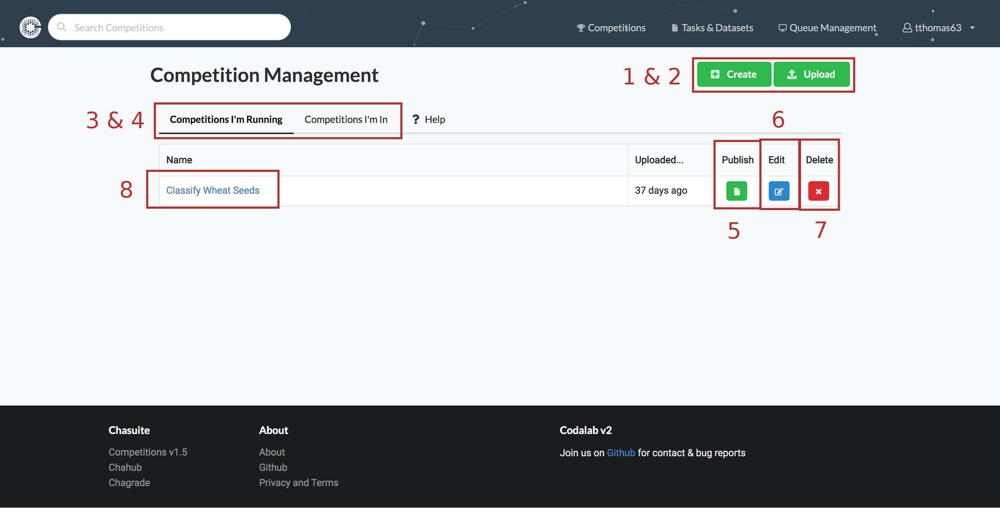

This page will show you how to create, manage, edit and delete your competitions.

It will also show you how to track the competitions you are currently in.

## Competition create button (Form)
This button will take you to the wizard/form for creating competitions. This will allow you to walk through each step of creating a competition using our creation/edit form. For more information on this form/wizard, please see the following link: [Competition Creation: Form](../Benchmark_Creation/Competition-Creation-Form.md)

## Competition create button (Upload)
This button will take you to the upload page for competition bundles. Here you will be able to upload a competition bundle, and if it is validated and processed successfully, you should see a link to your new competition. For more information on this page, please see the following link: [Competition Creation: Bundle](../Benchmark_Creation/Competition-Creation-Bundle.md)

## Competitions I'm running tab
This should be the default selection for the tab navigation at the top. Having this selected will show you all the competitions you currently run/manage, and the available actions for them.

## Competitions I'm in tab
Clicking on this tab will change the main view of the page. You should now see a list of competitions you're competing in (Without any competition administrator options). Clicking any of these titles should bring you to the competition detail page of that competition.

## Publish competition button
This button will publish your competition in order to make it publicly available. If your competition is already published, this button will appear green and be used to remove your competition from public availability (It will not be deleted). By default, if your competition is un-published, it appears grey.

## Edit competition button
This button will take you to the wizard/form for editing competitions. For more information on the competition edit form, please see the link [here](../Benchmark_Creation/Competition-Creation-Form.md)

## Delete competition button
Deletes your competition. There will be a confirmation dialogue before deletion. We cannot recover deleted competitions.

## Competition link
A link to the competition's detail page where users can register, make submissions, view the leaderboard and terms, etc. For more information about the competition detail page, see the link [here](Competition-Detail-Page.md)
