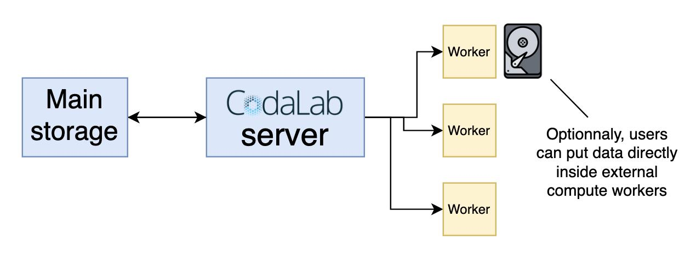

Compute workers are simply machines that are able to accept/send celery messages on the port used by the broker URL you wish to connect to that have a compute worker image, or other software to receive submissions. This means that you can add computing power to your competitions or benchmarks if needed! Any computer, from your own physical machines to virtual machines on cloud computing services can be used for this purpose. You can add multiple workers to a queue to process several submissions simultaneously.

!!! note "To use Podman, go to the [Podman documentation](Compute-worker-installation-with-Podman.md)."

**To use Docker, follow these instructions below:**

Steps:

 - Have a machine (_either physical or virtual, 100 GB storage recommended_)
 - Install Docker
 - Pull Compute Worker Image
 - Run the compute worker via Docker


## Install Docker
Either:

a) Install docker via the installation script: https://docs.docker.com/install/linux/docker-ce/ubuntu/#install-using-the-convenience-script

```bash
curl https://get.docker.com | sudo sh
sudo usermod -aG docker $USER
```

b) Install manually, following the steps at: https://docs.docker.com/install/

## Pull Compute Worker Image
On the compute worker machine, run the following command in a shell:
```bash
docker pull codalab/competitions-v2-compute-worker
```

That will pull the latest image for the v2 worker. For specific versions, see the docker hub page at:
https://hub.docker.com/r/codalab/competitions-v2-compute-worker/tags


## Start CPU worker
You will get your Broker URL from the instance. More information about Queues [here](Queue-Management.md)


Make a file `.env` and put this in it:
```ini title=".env"
BROKER_URL=pyamqp://<login>:<password>@www.codabench.org:5672/
HOST_DIRECTORY=/codabench
# If SSL isn't enabled, then comment or remove the following line
BROKER_USE_SSL=True
#USE_GPU=True
#GPU_DEVICE=nvidia.com/gpu=all
```

!!! note
    - The broker URL is a unique identifier of the job queue that the worker should listen to. To create a queue or obtain the broker URL of an existing queue, you can refer to [Queue Management](Queue-Management.md) docs page.

    - `/codabench` -- this path needs to be volumed into `/codabench` on the worker, as you can see below. You can select another location if convenient.

Create a `docker-compose.yml` file and paste the following content in it:
```yaml title="docker-compose.yml"
# Codabench Worker
services:
    worker:
        image: codalab/codabench-compute-worker:latest
        container_name: compute_worker
        volumes:
            - /codabench:/codabench
            - /var/run/docker.sock:/var/run/docker.sock
        env_file:
            - .env
        restart: unless-stopped
        #hostname: ${HOSTNAME}
        logging:
            options:
                max-size: 50m
                max-file: 3

```
!!! note 
    `hostname: ${HOSTNAME}` allows you to set the hostname of the compute worker container, which will then be shown in the [server status](Server-status-page.md) page on Codabench. This can be set to anything you want, by setting the `HOSTNAME` environment variable on the machine hosting the Compute Worker, then uncommenting the line the `docker-compose.yml` before launching the compute worker.

!!! note
    Starting from `codalab/competitions-v2-compute-worker:v1.22` the images are now unifed for Podman and Docker CPU/GPU

You can then launch the worker by running this command in the terminal where the `docker-compose.yml` file is located:
```bash
docker compose up -d
```

### Deprecated method (one liner)
Alternately, you can use the docker run below:
```bash
docker run \
    -v /codabench:/codabench \
    -v /var/run/docker.sock:/var/run/docker.sock \
    -d \
    --env-file .env \
    --name compute_worker \
    --restart unless-stopped \
    --log-opt max-size=50m \
    --log-opt max-file=3 \
    codalab/competitions-v2-compute-worker:latest
```


## Start GPU worker
Make a `.env` file, as explained in CPU worker instructions.

!!! warning
    Don't forget the `USE_GPU=true` in the `.env` if you want to use a GPU runner

Then, install the NVIDIA toolkit:
[Nvidia toolkit installation instructions](https://docs.nvidia.com/datacenter/cloud-native/container-toolkit/latest/index.html)

Once you install and configure the NVIDIA container toolkit, you can create a `docker-compose.yml` file with the following content:
```yaml title="docker-compose.yml"
# Codabench GPU worker (NVIDIA)
services:
    worker:
        image: codalab/codabench-compute-worker:latest
        container_name: compute_worker
        volumes:
            - /codabench:/codabench
            - /var/run/docker.sock:/var/run/docker.sock
        env_file:
            - .env
        restart: unless-stopped
        #hostname: ${HOSTNAME}
        logging:
            options:
                max-size: 50m
                max-file: 3
```
!!! note 
    `hostname: ${HOSTNAME}` allows you to set the hostname of the compute worker container, which will then be shown in the [server status](Server-status-page.md) page on Codabench. This can be set to anything you want, by setting the `HOSTNAME` environment variable on the machine hosting the Compute Worker, then uncommenting the line the `docker-compose.yml` before launching the compute worker.

!!! note
    Starting from `codalab/competitions-v2-compute-worker:v1.22` the images are now unifed for Podman and Docker CPU/GPU

You can then launch the worker by running this command in the terminal where the `docker-compose.yml` file is located:
```bash
docker compose up -d
```


### NVIDIA-docker Wrapper (deprecated method)
[Nvidia installation instructions](https://github.com/NVIDIA/nvidia-docker#quickstart)
```bash
nvidia-docker run \
    -v /codabench:/codabench \
    -v /var/run/docker.sock:/var/run/docker.sock \
    -v /var/lib/nvidia-docker/nvidia-docker.sock:/var/lib/nvidia-docker/nvidia-docker.sock \
    -d \
    --env-file .env \
    --name compute_worker \
    --restart unless-stopped \
    --log-opt max-size=50m \
    --log-opt max-file=3 \
    codalab/competitions-v2-compute-worker:gpu
```

Note that a competition docker image including CUDA and other GPU libraries, such as `codalab/codalab-legacy:gpu`, is then required.

## Check logs

Use the following command to check logs and ensure everything is working fine:

```bash
docker logs -f compute_worker
```

## Cleaning up periodically

It is recommended to clean up docker images and containers regularly to avoid filling up the storage.

1. Run the following command:

```bash
sudo crontab -e
```

2. Add the following line:

```bash
@daily docker system prune -af
```

## Keep track of the worker

It is recommended to store the docker container hostname to identify the worker. This way, it is easier to troubleshoot issues when having multiple workers in one queue. To get the hostname, simply run `docker ps` and look at the key `CONTAINER ID` at the beginning of the output:

```sh
$ docker ps
CONTAINER ID   IMAGE                                           COMMAND                  CREATED      STATUS      PORTS     NAMES
1a2b3d4e5f67   codalab/competitions-v2-compute-worker:latest   "/bin/sh -c 'celery …"   3 days ago   Up 3 days             compute_worker
```

For each submission made to your queue, you can know what worker computed the ingestion and the scoring jobs in the [server status page](Server-status-page.md).

---

## Optional: put data directly inside the compute worker

The folder `$HOST_DIRECTORY/data`, usually `/codabench/data`, is shared between the host (the compute worker) and the container running the submission (a new container is created for each submission). It is mounted inside the container as `/app/data`. This means that you can put data in your worker, in `$HOST_DIRECTORY/data`, so it can be read-only accessed during the job's process. You'll need to modify the scoring and/or ingestion programs accordingly, to points to `/app/data`. This is especially useful if you work with confidential data, or with a heavy dataset.

!!! note "If you have several workers in your queue, remember to have the data accessible for each one."




!!! warning 
    Make sure to make the owner of the folder(s) and file(s) the same as the one launching the compute worker.  
       - `root` for Docker rootfull  
       - `codalab` for Podman and Docker rootless if you created a user name codalab to launch podman and docker rootless from


!!! tip "If you simply wish to set up some compute workers to increase the computing power of your benchmark, you don't need to scroll this page any further."
---

## Building compute worker

This is helpful only if you want to build the compute worker image. It is not needed if you simply want to set up compute workers to run submissions.

To build the normal image:

```bash
docker build -t codalab/codabench-compute-worker:latest -f packaging/container/Containerfile.compute_worker .
```

To update the image (add tag `:latest`, `:gpu` or else if needed)

```bash
docker push codalab/codabench-compute-worker
```

!!! note "If you have running compute workers, you'll need to pull again the image and to restart the workers to take into account the changes."


## Update docker image

If the compute worker docker image was updated, you can reflect the changes using the following commands.

Check no job is running:

```sh
docker ps
```

Update the worker:

```sh
docker compose down
docker compose pull
docker compose up -d
```