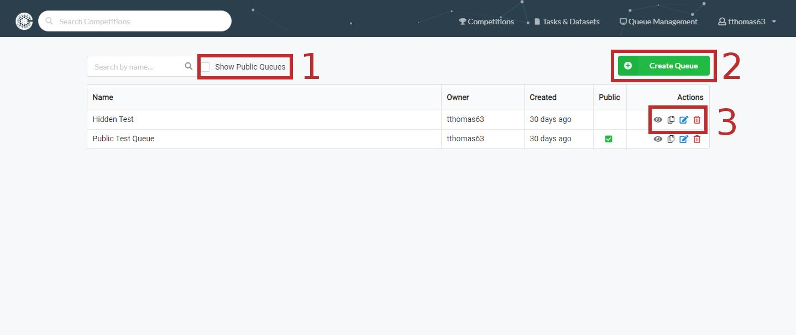
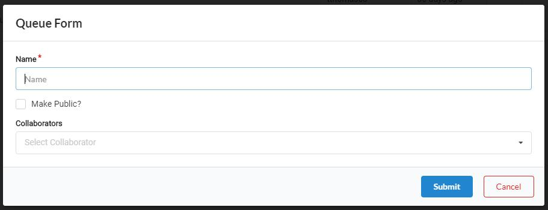
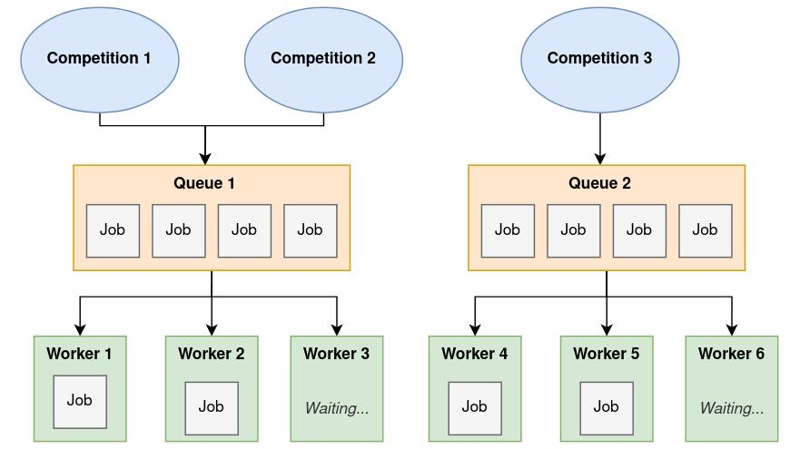

The queue management page lists all queues you have access to, and optionally all current public queues. 

For queues you've created, it will also show options for editing, deleting, copying and displaying the broker URL. 

You can also create new queues from this page. You can use the [server status page](Server-status-page.md) to have an overview of the submissions made to a queue you own.

1) [Show Public Queues](Queue-Management.md#show-public-queues)   
2) [Create Queue](Queue-Management.md#create-queue)   
3) [Action Buttons](Queue-Management.md#action-buttons)   

   - Eye Icon
   - Document Icon
   - Edit Icon
   - Trash Icon

## Show Public Queues
Enabling this checkbox will display public queues as well as queues you organized, or have been given access to. You will not be able to edit them, but you can view queue details and copy the broker URL.

## Create Queue
Clicking this button will bring up a modal with the queue form.

The following fields are present:

- Name: The name of the queue
- Make Public: If checked, this queue will be available for public use.
- Collaborators: A multi-select field that you can search for users by username or email. These will be people who have access to your queue.

## Action Buttons

### Eye Icon
Clicking this button will show you details about your queue such as the Broker URL and Vhost name. 

### Document Icon
The document icon is used to copy the broker URL to your clipboard with one-click.

### Edit Icon
The edit icon brings up the queue modal/form for editing the current queue.

### Trash Icon
The trash icon deletes the current queue. There will be a confirmation dialogue. Once this is done your queue is gone forever so be careful.

--- 

## Compute workers setup

See [compute worker management and setup](Compute-Worker-Management---Setup.md) for more information about workers configuration.

Internal and external compute workers can be linked to Codabench competitions. The queues dispatch the jobs between the compute workers. Note that a queue can receive jobs (submissions) from several competitions, and can send them to several compute workers. The general architecture of queues and workers can be represented like this:

