This page is where you can manage your resources e.g. Submissions, Datasets, Programs, Tasks, and Competition Bundles. You can also view and manage your quota on this page.


You can access this interface by clicking on "**Resources**" in the main menu:
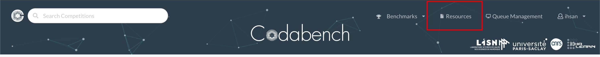


---

## Submissions 
In this tab, you can view all your submissions either uploaded in this interface or submitted to a competition.
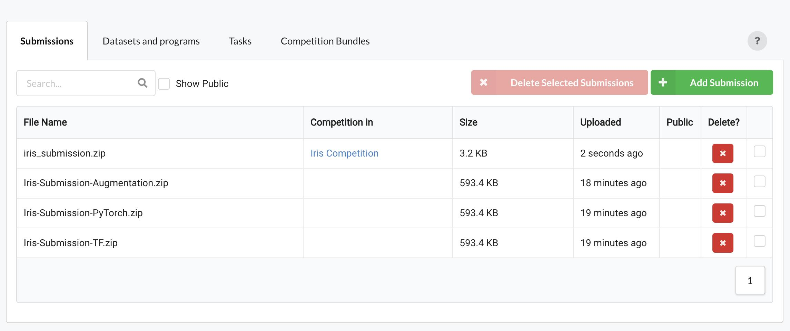

By clicking the `Add Submission` button you can fill a form and attach a submission file to upload a new submission. This is useful in different cases e.g. when you want to share a sample submission with the participants of a competition you are organizing.
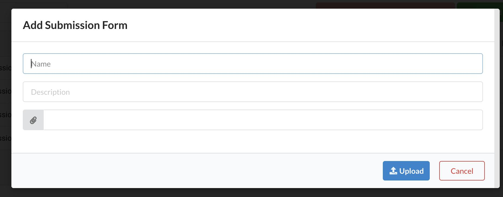


## Datasets/Programs
In this tab,  you can view the datasets and programs that you have uploaded. You can also view auto-created and publicly available datasets/programs by checking the relevant checkboxes. 

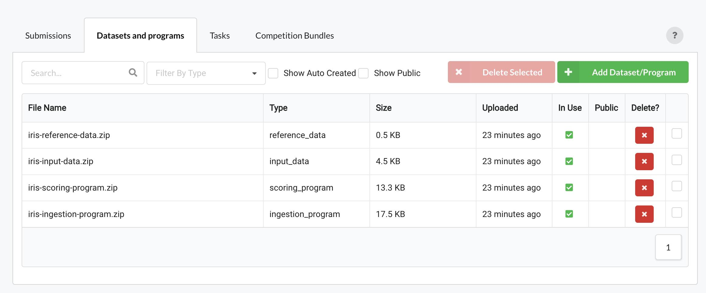

By clicking the `Add Dataset/Program` button you can fill a form and attach a dataset file to upload.

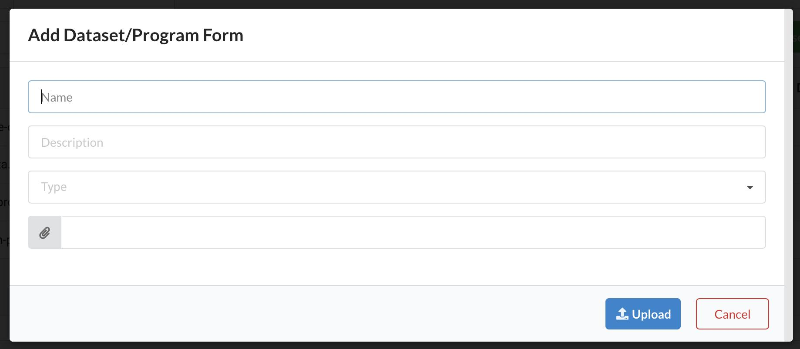

You can click on a dataset/program and make it public or private. This is useful when you want to share a dataset with participants so that hey can use it to prepare a submission for a competition.

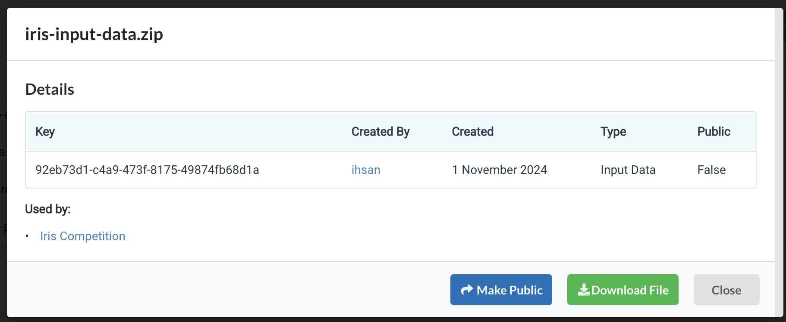


For a general breakdown of the roles of different types of datasets, see this link: [Competition Bundle Structure: Data types and their role](https://docs.codabench.org/latest/Organizers/Benchmark_Creation/Competition-Bundle-Structure/#data-types-and-their-role).


## Tasks
In this tab, you can manage your tasks. You can create a new task, upload a task, edit a task and check task details.
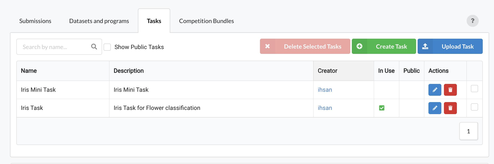


### Create New Task
To create a new task, you have to fill the form by entering task name and description
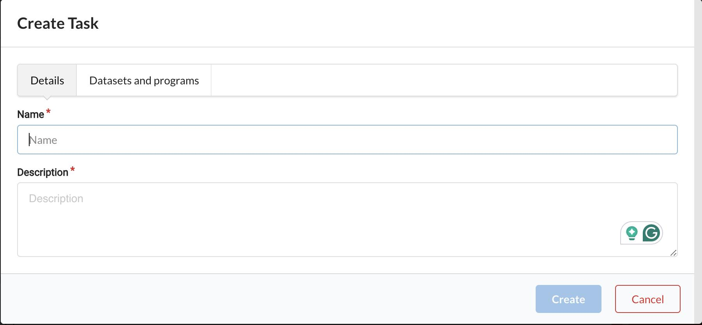

You also have to select datasets and programs from the already uploaded ones in the Datasets/Programs tab
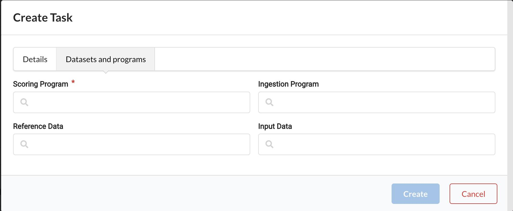


### Edit a Task
You can change the task name and description 
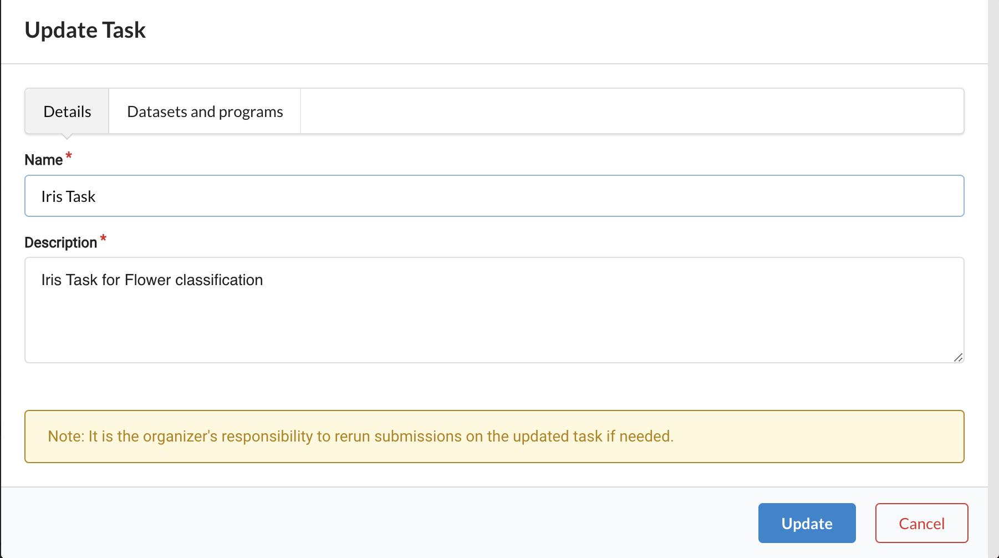

You can also change the datasets/programs used in the task
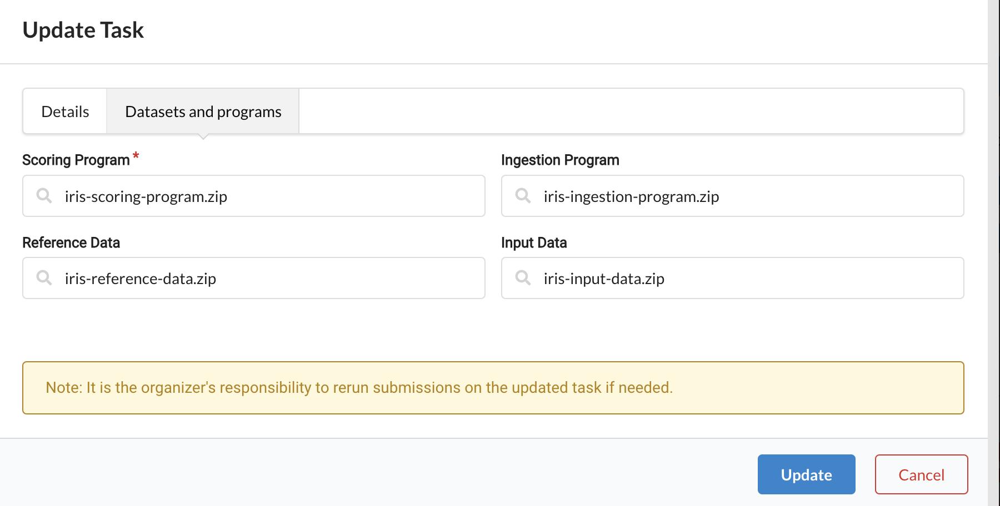

!!! note
    Organizers should be careful when updating a task because some submissions may have used the task and updating the task will not allow you to rerun those submissions because the task they have used is now changed.


### Upload a Task
You can create a new task by uploading a task zip that has the required files in the correct format.
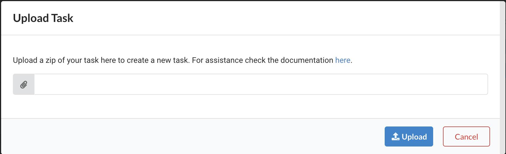


Create a zip file that consists of a `task.yaml` file and zips of datasets/programs if required. You can use already existing datasets/prograsm by using their keys in the yaml, or upload new datasets/programs or use a mix of keys and files e.g. you choose to use already existing input data and reference data but use zip files for ingestion and scoring program. In the last case, codabench will create two programs and then use them in your task and will use existing datasets in the same task.

Check the files below for examples of task upload zips.

- [task_with_keys_only.zip](https://github.com/user-attachments/files/17597251/task_with_keys_only.zip)
- [task_with_files_only.zip](https://github.com/user-attachments/files/17597252/task_with_files_only.zip)
- [task_with_mix_of_keys_and_files.zip](https://github.com/user-attachments/files/17597265/task_with_mix_of_keys_and_files.zip)

For reference, here is the content of the `task.yaml` file that you can find inside the `task_with_mix_of_keys_and_files.zip` task:
```yaml title="task.yaml"
name: Iris Task
description: Iris Task for Flower classification
is_public: false
scoring_program:
  zip: iris-scoring-program.zip
ingestion_program:
  zip: iris-ingestion-program.zip
input_data:
  key: 6c3e6dde-d0fa-4c22-af66-030187dbfd4f
reference_data:
  key: c4179c3f-498c-486a-8ac5-1e194036a3ed
```


### Task Details
In the task details, you can view all the task details e.g. title, description, task owner, created date, people with whom this task is shared, competitions where this task is used, the datasets/programs used in this task and option to download them, and option to make the task public/private.
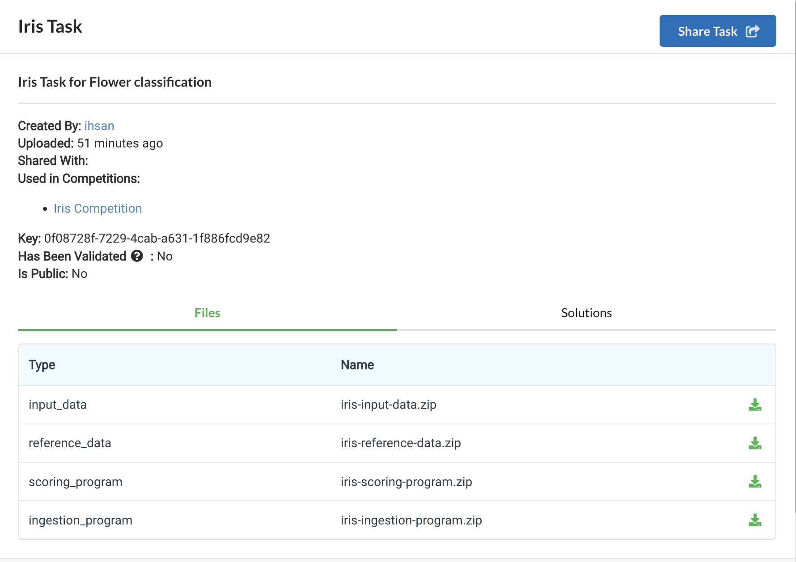


## Competition Bundles
In this tab, you can mange your competition bundles. These bundles are stored when you create your competitions using a zip. 
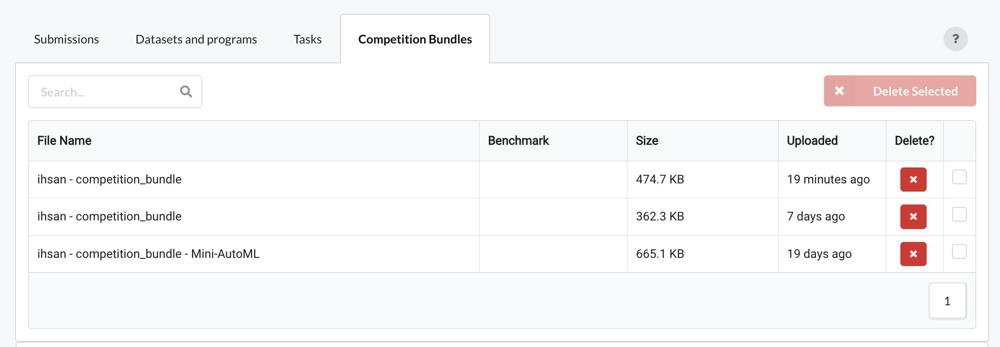


## Quota and Cleanup
This section of the resource interface shows you the usage of your quota. A free quota of 15 GB is given to all the users and this can be increased by the platform administrators in special circumstances for selected users. You can also do some quick cleanup from here by deleting unused resources e.g. submissions, datasets and tasks etc.
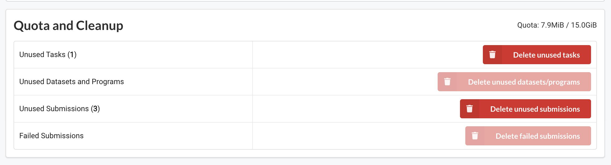


