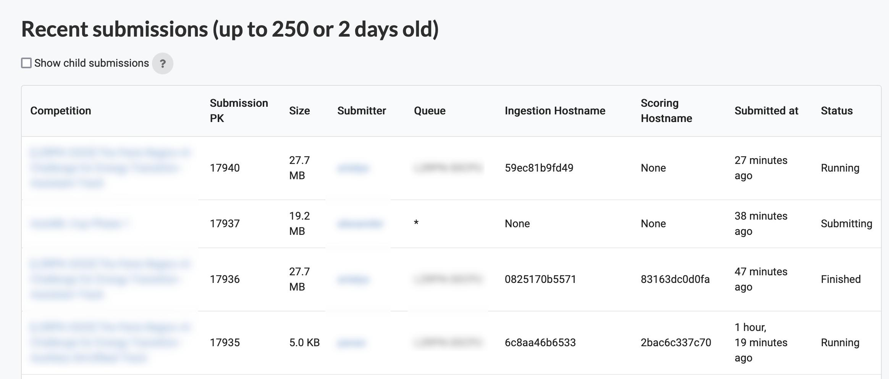
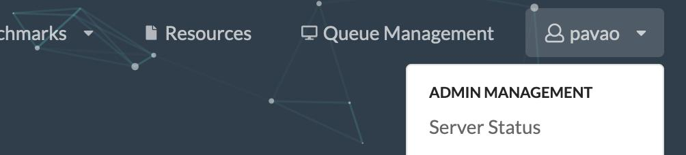
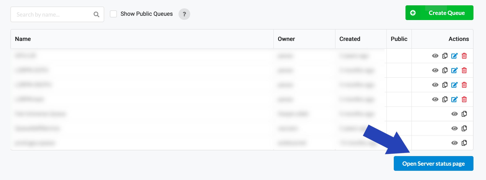

The server status page gives information about past and current submissions, and is useful for troubleshooting. Any user can access the interface, and get information about their own submissions and the submissions made to queues they own. Administrators can see all submissions. Here is an overview of the page:

Note that `*` refers to the default queue of the platform. "Hostname" refers to the docker container ID of the compute worker that computed the job.

## How to access the interface

You can access it either from the top right menu, or from the "[Queue management](Queue-Management.md)" page, as shown in the screenshots below.

