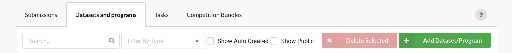
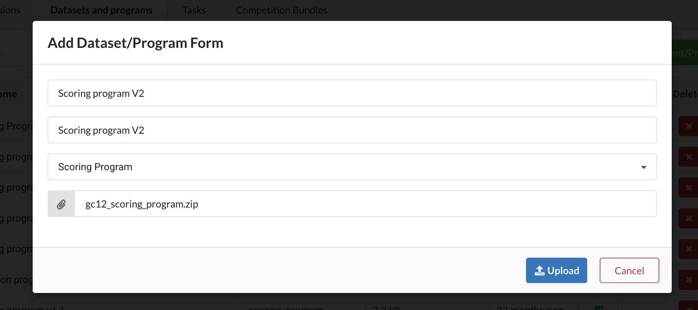
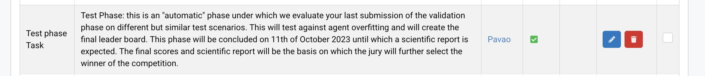
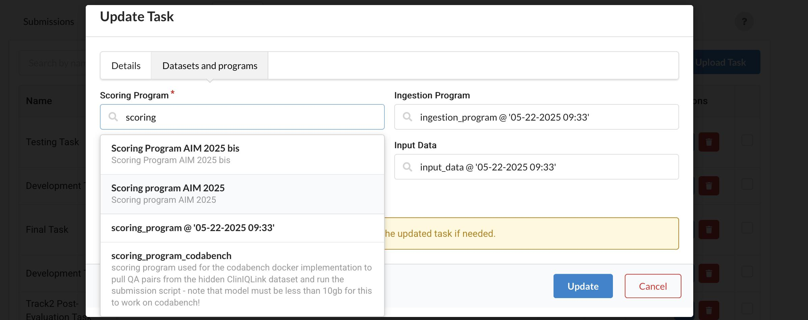
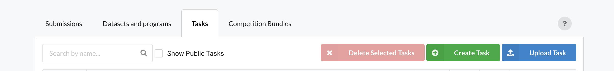
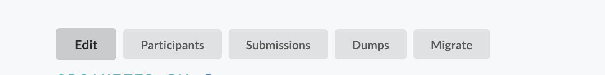
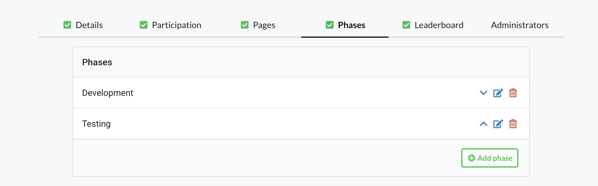
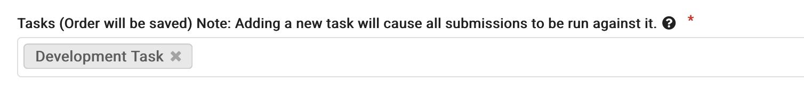

In this page, you'll learn how to update critical elements of your benchmark like the scoring program or the reference data, while your benchmark is already up and running.

For a general overview of resources management, [click here](Resource-Management.md).

If order to update your programs or data, you have two approaches:
- **A.** Edit an existing Task (simpler and straightforward)
- **B.** Create a new Task

Let's see both approach in detail.

## A. Edit an existing Task

### 1. Prepare the new dataset or program

- Make local changes to the elements you want to update: scoring program, ingestion program, input data and/or reference data.

- Zip the new version of your program or data. **Make sure to zip the files at the root of the archive, without zipping the folder structure.**

### 2. Upload the new dataset or program 

- Go to Resources

- Go to "Datasets and Programs" and click on "Add Dataset/Program"

- Fill in the form: Name the new program or dataset, select the type (scoring program, input data, etc.), and select your ZIP file

### 3. Update the Task used by your benchmark

Still on "Resources" page, go to the "Task" tab. Find the task you want to edit. In order to recognize it, make sure it is marked as "In Use", and click to see more information and make sure it is related to the right benchmark.

Then click on the pencil symbol to edit it:

Start typing the name of your new program or dataset in the corresponding field and select it, then save.

**Done!** Your task is updated and its new version will be triggered by new submissions. You don't need to update the benchmark/competition for the change to take effect.

## B. Create a new Task

### 1. Prepare your new dataset / program

First, upload the new versions of your program and/or dataset. To that end, follow steps **1.** and **2.** presented above.

### 2. Create Task

- Go to "Resources" > "Task" > "Create Task"

- Fill in all fields: Name, Description, Scoring program, (optionally: Ingestion program, Reference data, Input data)

### Edit your benchmark

- Once your task is created, go to the editor of your challenge

- Go to "Phases" and edit the relevant phase

- Select your new task and save

**Done!** Your benchmark is now ready to run your new task for future submissions.
