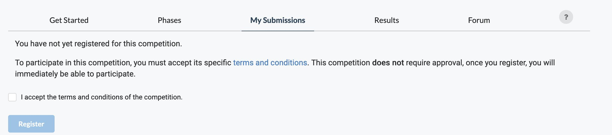
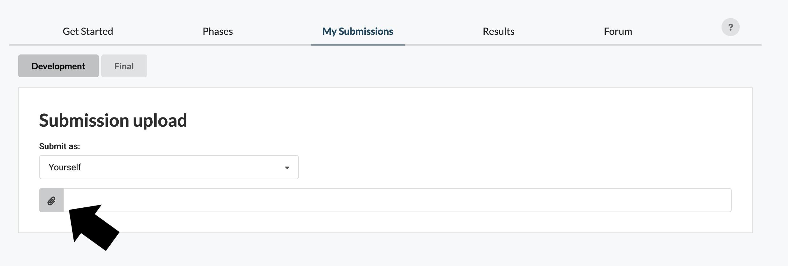
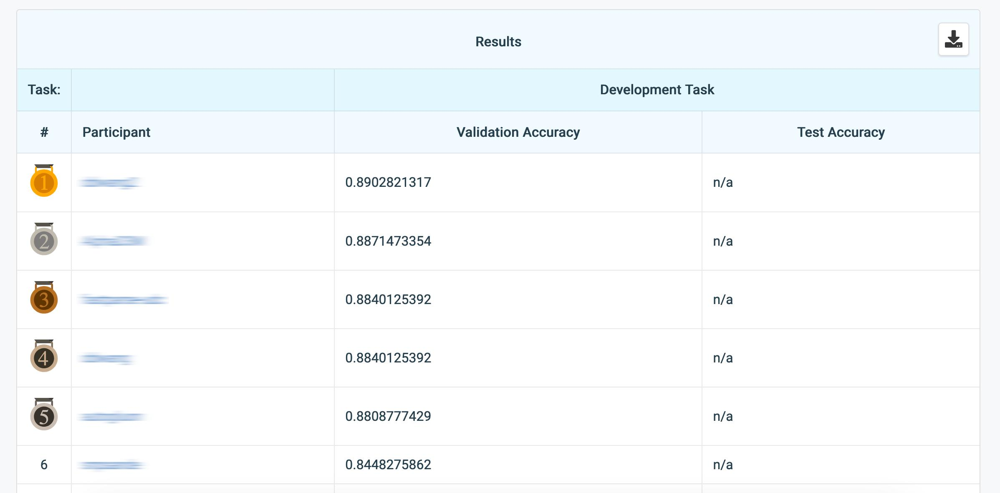

### Signing up and updating your settings
When you sign up, you will have to provide your name and a valid email.

### Registering for a Benchmark
To make an entry in a benchmark click on the "My Submissions" tab, you will then be prompted to accept the rules to register to that benchmark. When registering, a request may be sent to the benchmark organizer. You will be notified when the benchmark organizer has approved your registration request. Follow the instructions of the organizers.

### Making a Submission
Making a submission to a benchmark involves uploading a bundle (.zip archive) containing files with your answer, in the format that has been specified by the benchmark organizer. There are two types of submissions: 
- **_Code_** submissions contain a metadata file specifying the command to execute
- **_Results_** submission contain the solution to the problem (no code executed on the platform)

**To make a submission**

1. [Sign in to Codabench](https://codabench.org/). If you do not have an account, you will need to create one.
1. Select the benchmark you want to work with.
1. Click the **My Submissions** tab. Here, you can access the data that has been provided by the benchmark organizer.
1. Click on the **paper clip logo** and select your zip file.

On this page, you can make new submissions, and see previous submissions for each phase in the competition.

You can also view all your submissions in the [Resources Interface](../Organizers/Running_a_benchmark/Resource-Management.md).

### Viewing Benchmark Results
You can keep up with the progress of benchmarks you are participating in by clicking on the **Results** tab. This will display the leaderboard.

